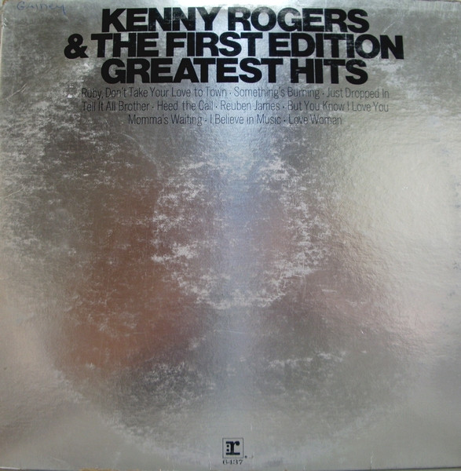

# Greatest Hits

By Kenny Rogers & The First Edition

## Album Data

[Discogs URL](https://www.discogs.com/release/555803-Kenny-Rogers-&-The-First-Edition-Greatest-Hits)

- Catalog #: RS 6437
- Label: Reprise Records
- Formats: Vinyl, Pitman Pressing
- Format: LP, Comp, Pit, Compilation
- Rating: 
- Released: 1971
- Year: 1971
- Release ID: 555803
- Media condition: Very Good Plus (VG+)
- Sleeve condition: Very Good Plus (VG+)
- Speed: 33 rpm
- Weight: 

## Album Tracks

| **Position** | **Title** | **Duration** |
|--------------|-----------|--------------|
| A1 | **Ruby, Don't Take Your Love To Town** | 2:56 |
| A2 | **But You Know I Love You** | 3:04 |
| A3 | **Just Dropped In (To See What Condition My Condition Was In)** | 3:20 |
| A4 | **Momma's Waiting** | 3:25 |
| A5 | **Heed The Call** | 3:17 |
| B1 | **Something's Burning** | 4:00 |
| B2 | **Reuben James** | 2:44 |
| B3 | **I Believe In Music** | 4:05 |
| B4 | **Love Woman** | 2:45 |
| B5 | **Tell It All Brother** | 3:18 |

## Artist Roles

| **Name** | **Role** |
|----------|----------|
| **Jimmy Bowen** | Producer |
| **Kenny Rogers** | Producer |
| **Mike Post** | Producer |

## See also

- 
