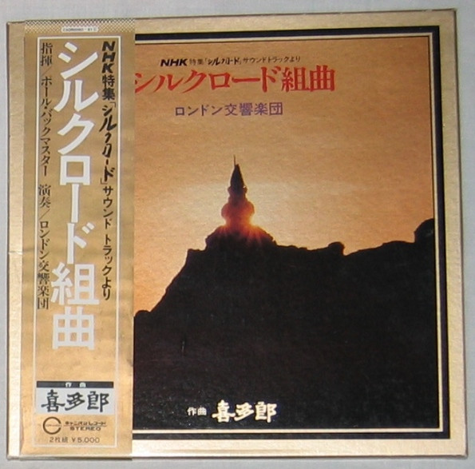

# シルクロード組曲

By "Kitaro, The London Symphony Orchestra"

## Album Data

[Discogs URL](https://www.discogs.com/release/2655039-"Kitaro,-The-London-Symphony-Orchestra"-シルクロード組曲)

- Catalog #: C50R0060-61
- Label: Canyon
- Format: 2xLP, Album + Box
- Rating: 
- Released: 1980
- Release ID: 2655039
- Media condition: Very Good Plus (VG+)
- Sleeve condition: Very Good Plus (VG+)
- Speed: 33 rpm
- Weight: 

