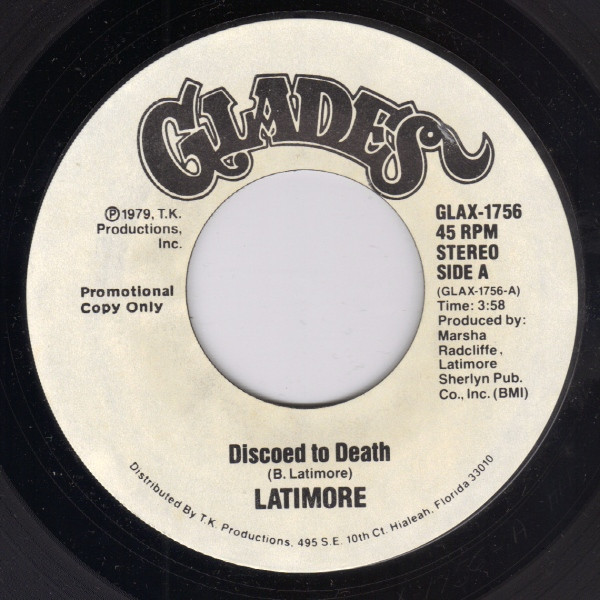

# Discoed To Death / Just One Step

By Latimore

## Album Data

[Discogs URL](https://www.discogs.com/release/2825980-Latimore-(2)-Discoed-To-Death-/-Just-One-Step)

- Catalog #: GLAX-1756
- Label: Glades
- Formats: Vinyl
- Format: 7", 45 RPM
- Rating: 
- Released: 1979
- Year: 1979
- Release ID: 2825980
- Media condition: Very Good Plus (VG+)
- Sleeve condition: Generic
- Speed: 45 rpm
- Weight: 

## Album Tracks

| **Position** | **Title** | **Duration** |
|--------------|-----------|--------------|
| A | **Discoed To Death** | 3:58 |
| B | **Just One Step** | 3:58 |

## See also

- 
