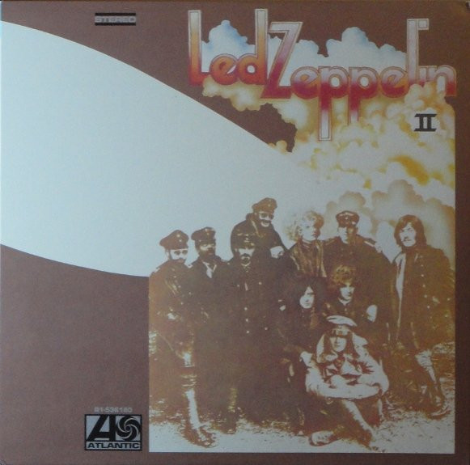

# Led Zeppelin II

By Led Zeppelin

## Album Data

[Discogs URL](https://www.discogs.com/release/5780606-Led-Zeppelin-Led-Zeppelin-II)

- Catalog #: R1-536180
- Label: Atlantic
- Format: LP, Album, RE, RM + LP + Dlx, 180
- Rating: 
- Released: 2014
- Release ID: 5780606
- Media condition: Mint (M)
- Sleeve condition: Mint (M)
- Speed: 33 rpm
- Weight: 180 gram

## See also

- [Houses Of The Holy](Houses_Of_The_Holy.md)
- [Led Zeppelin III](Led_Zeppelin_III.md)
- [Led Zeppelin](Led_Zeppelin.md)
- [Physical Graffiti](Physical_Graffiti.md)
- [Untitled](Untitled.md)
- [Whole Lotta Love](Whole_Lotta_Love.md)
