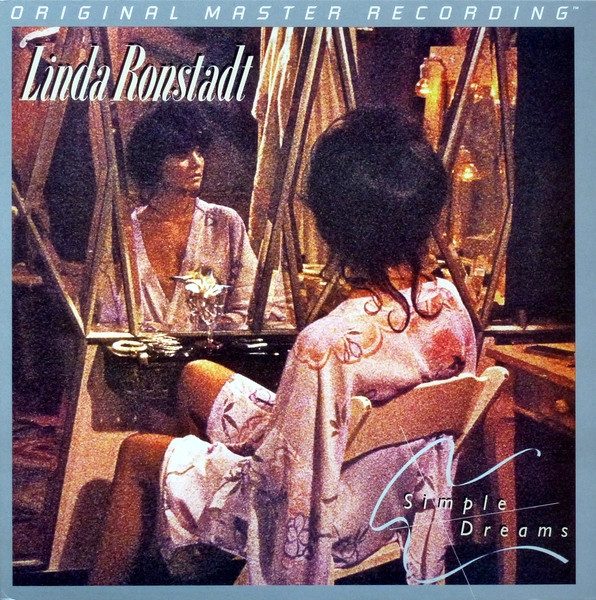

# Simple Dreams

By Linda Ronstadt

## Album Data

[Discogs URL](https://www.discogs.com/release/3793108-Linda-Ronstadt-Simple-Dreams)

- Catalog #: MFSL 1-321
- Label: Mobile Fidelity Sound Lab
- Formats: Vinyl, 180 Gram, Gatefold
- Format: LP, Ltd, Num, RE, RM, 180, Limited Edition, Numbered, Reissue, Remastered
- Rating: 
- Released: 2010
- Year: 1977
- Release ID: 3793108
- Media condition: Mint (M)
- Sleeve condition: Mint (M)
- Speed: 33 rpm
- Weight: 180 gram

## Album Tracks

| **Position** | **Title** | **Duration** |
|--------------|-----------|--------------|
| A1 | **It's So Easy** | 2:27 |
| A2 | **Carmelita** | 3:07 |
| A3 | **Simple Man, Simple Dreams** | 3:12 |
| A4 | **Sorrow Lives Here** | 2:57 |
| A5 | **I Never Will Marry** | 3:12 |
| B1 | **Blue Bayou** | 3:57 |
| B2 | **Poor Poor Pitiful Me** | 3:42 |
| B3 | **Maybe I'm Right** | 3:05 |
| B4 | **Tumbling Dice** | 3:05 |
| B5 | **Old Paint** | 3:05 |

## Artist Roles

| **Name** | **Role** |
|----------|----------|
| **John Kosh** | Design, Art Direction |
| **Shawn R. Britton** | Lacquer Cut By [Runout Etchings] |
| **Shawn R. Britton** | Mastered By [Half-Speed] |
| **Dan Dugmore** | Performer |
| **Don Grolnick** | Performer |
| **Kenny Edwards** | Performer |
| **Linda Ronstadt** | Performer |
| **Rick Marotta** | Performer |
| **Waddy Wachtel** | Performer |
| **Jim Shea** | Photography By |
| **Peter Asher** | Producer [Produced By] |
| **Mark Howlett** | Recorded By [Assisted By], Mixed By [Assisted By] |
| **Val Garay** | Recorded By, Mixed By |

## See also

- [Don't Cry Now](Dont_Cry_Now.md)
- [Hasten Down The Wind](Hasten_Down_The_Wind.md)
- [Heart Like A Wheel](Heart_Like_A_Wheel.md)
- [Beets: Hasten Down the Wind](../../Beets/Linda_Ronstadt/Hasten_Down_the_Wind.md)
- [Beets: Heart Like a Wheel](../../Beets/Linda_Ronstadt/Heart_Like_a_Wheel.md)
- [Beets: Simple Dreams](../../Beets/Linda_Ronstadt/Simple_Dreams.md)
- [Roon: Canciones de mi Padre (2016 Remaster)](../../Roon/Linda_Ronstadt/Canciones_de_mi_Padre_2016_Remaster.md)
- [Roon: Different Drum](../../Roon/Linda_Ronstadt/Different_Drum.md)
- [Roon: Get Closer](../../Roon/Linda_Ronstadt/Get_Closer.md)
- [Roon: Hasten Down the Wind](../../Roon/Linda_Ronstadt/Hasten_Down_the_Wind.md)
- [Roon: Heart Like A Wheel](../../Roon/Linda_Ronstadt/Heart_Like_A_Wheel.md)
- [Roon: Linda Ronstadt](../../Roon/Linda_Ronstadt/Linda_Ronstadt.md)
- [Roon: Living in the USA](../../Roon/Linda_Ronstadt/Living_in_the_USA.md)
- [Roon: Lush Life](../../Roon/Linda_Ronstadt/Lush_Life.md)
- [Roon: Mad Love](../../Roon/Linda_Ronstadt/Mad_Love.md)
- [Roon: Mas Canciones (2016 Remaster)](../../Roon/Linda_Ronstadt/Mas_Canciones_2016_Remaster.md)
- [Roon: Silk Purse](../../Roon/Linda_Ronstadt/Silk_Purse.md)
- [Roon: Simple Dreams (40th Anniversary Edition)](../../Roon/Linda_Ronstadt/Simple_Dreams_40th_Anniversary_Edition.md)
- [Roon: The Stone Poneys](../../Roon/Linda_Ronstadt/The_Stone_Poneys.md)
