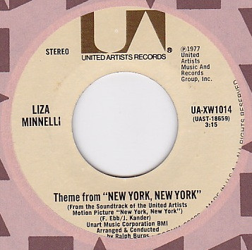

# Theme From New York New York

By Liza Minnelli

## Album Data

[Discogs URL](https://www.discogs.com/release/3106526-Liza-Minnelli-Theme-From-New-York-New-York)

- Catalog #: UA-XW1014
- Label: United Artists Records
- Format: 7", Single
- Rating: 
- Released: 1977
- Release ID: 3106526
- Media condition: Very Good Plus (VG+)
- Sleeve condition: 
- Speed: 45 rpm
- Weight: 

