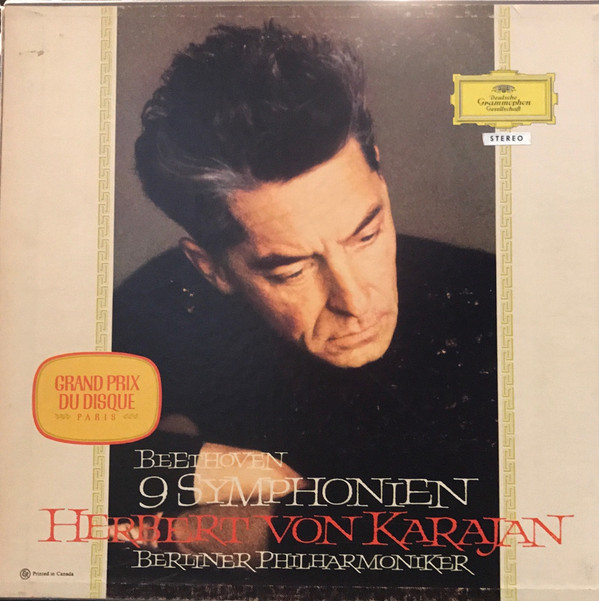

# 9 Symphonien

By "Ludwig van Beethoven, Herbert von Karajan, Berliner Philharmoniker"

## Album Data

[Discogs URL](https://www.discogs.com/release/8919456-"Ludwig-van-Beethoven,-Herbert-von-Karajan,-Berliner-Philharmoniker"-9-Symphonien)

- Catalog #: SKL 101/8
- Label: Deutsche Grammophon
- Format: 8xLP, Ltd, Num + Box, Ltd, Num
- Rating: 
- Released: 2016
- Release ID: 8919456
- Media condition: Mint (M)
- Sleeve condition: Mint (M)
- Speed: 33 rpm
- Weight: 180 gram

## Album Tracks

| **Position** | **Title** | **Duration** |
|--------------|-----------|--------------|
|  | **Symphonie Nr. 1 C-Dur Op. 21** |  |
|  | **Symphonie Nr. 2 D-Dur Op. 36** |  |
|  | **Symphonie Nr. 3 Es-Dur Op. 55 »Eroica­­«** |  |
|  | **Symphonie Nr. 4 B-Dur Op. 60** |  |
|  | **Symphonie Nr. 5 C-Moll Op. 67** |  |
|  | **Symphonie Nr. 6 F-Dur Op. 68 »Pastorale«** |  |
|  | **Symphonie Nr. 7 A-Dur Op. 92** |  |
|  | **Symphonie Nr. 8 F-Dur Op. 93** |  |
|  | **IX. Symphonie D-Moll Op. 125** |  |

## See also

- 
