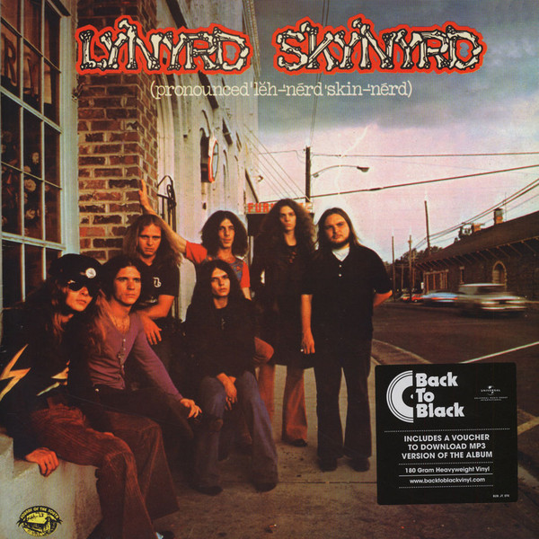

# (Pronounced 'Lĕh-'nérd 'Skin-'nérd)

By Lynyrd Skynyrd

## Album Data

[Discogs URL](https://www.discogs.com/release/6795525-Lynyrd-Skynyrd-(Pronounced-'Lĕh-'nérd-'Skin-'nérd))

- Catalog #: 5355016
- Label: MCA Records
- Formats: Vinyl, 180 Gram, Gatefold
- Format: LP, Album, RE, 180
- Rating: 
- Released: 2015
- Year: 1973
- Release ID: 6795525
- Media condition: Mint (M)
- Sleeve condition: Mint (M)
- Speed: 33 rpm
- Weight: 180 gram

## Album Tracks

| **Position** | **Title** | **Duration** |
|--------------|-----------|--------------|
| A1 | **I Ain't The One** | 3:51 |
| A2 | **Tuesday's Gone** | 7:32 |
| A3 | **Gimme Three Steps** | 4:30 |
| A4 | **Simple Man** | 5:57 |
| B1 | **Things Goin' On** | 4:57 |
| B2 | **Mississippi Kid** | 3:57 |
| B3 | **Poison Whiskey** | 3:11 |
| B4 | **Free Bird** | 9:08 |

## Artist Roles

| **Name** | **Role** |
|----------|----------|
| **Ed King (2)** | Bass |
| **Roosevelt Gook** | Bass, Mellotron, Harmony Vocals |
| **Bob Burns (2)** | Drums |
| **Robert Nix** | Drums |
| **Bob Langford** | Engineer |
| **Danny Turbeville** | Engineer |
| **Rodney Mills** | Engineer |
| **Steve Katz** | Harmonica |
| **Billy Powell** | Keyboards |
| **Allen Collins** | Lead Guitar |
| **Ed King (2)** | Lead Guitar |
| **Gary Rossington** | Lead Guitar |
| **Ronnie Van Zant** | Lead Vocals |
| **Roosevelt Gook** | Mandolin, Bass Drum |
| **Roosevelt Gook** | Organ |
| **Bobbye Hall** | Percussion |
| **Emerson-Loew** | Photography By [Cover & All Others] |
| **Tom Hill (8)** | Photography By [On Stage] |
| **Al Kooper** | Producer, Engineer, Remix |
| **Allen Collins** | Rhythm Guitar |
| **Gary Rossington** | Rhythm Guitar |

## See also

- [One More For The Fans](One_More_For_The_Fans.md)
- [Beets: All Time Greatest Hits](../../Beets/Lynyrd_Skynyrd/All_Time_Greatest_Hits.md)
- [Beets: (pronounced ’lĕh‐’nérd ’skin‐’nérd)](../../Beets/Lynyrd_Skynyrd/pronounced_’lĕh‐’nérd_’skin‐’nérd.md)
- [Roon: (Pronounced 'Lĕh-'nérd 'Skin-'nérd)](../../Roon/Lynyrd_Skynyrd/Pronounced_Lĕh-nérd_Skin-nérd.md)
