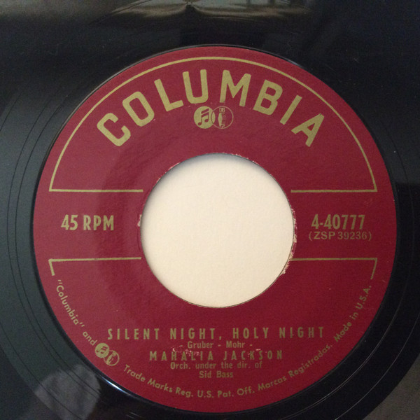

# "Silent Night, Holy Night / Mary's Little Boy Chile"

By Mahalia Jackson

## Album Data

[Discogs URL](https://www.discogs.com/release/9763343-Mahalia-Jackson-"Silent-Night,-Holy-Night-/-Mary's-Little-Boy-Chile")

- Catalog #: 4-40777
- Label: Columbia
- Formats: Vinyl
- Format: 7", Single, 45 RPM
- Rating: 
- Released: 1956
- Year: 0
- Release ID: 9763343
- Media condition: 
- Sleeve condition: 
- Speed: 
- Weight: 

## Album Tracks

| **Position** | **Title** | **Duration** |
|--------------|-----------|--------------|
| A | **Silent Night, Holy Night** |  |
| B | **Mary's Little Boy Chile** |  |

## Artist Roles

| **Name** | **Role** |
|----------|----------|
| **Sid Bass** | Conductor |

## See also

- 
