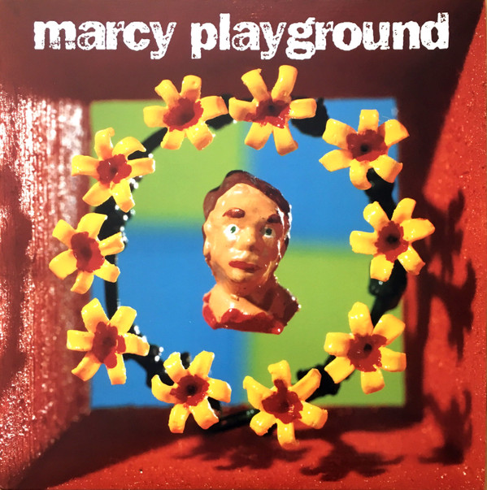

# Marcy Playground

By Marcy Playground

## Album Data

[Discogs URL](https://www.discogs.com/release/10174618-Marcy-Playground-Marcy-Playground)

- Catalog #: SDS-1501, B0026075-01, SDS-45-1501
- Label: Slow Down Sounds, Universal Music Special Markets, Slow Down Sounds
- Formats: Vinyl
- Format: LP, Album, RE + 7" + Ltd
- Rating: 
- Released: 2017
- Year: 1997
- Release ID: 10174618
- Media condition: Mint (M)
- Sleeve condition: Mint (M)
- Speed: 33 rpm
- Weight: 180 gram

## Album Tracks

| **Position** | **Title** | **Duration** |
|--------------|-----------|--------------|
| A1 | **Poppies** | 2:50 |
| A2 | **Sex And Candy** | 2:53 |
| A3 | **Ancient Walls Of Flowers** | 3:17 |
| A4 | **Saint Joe On The School Bus** | 3:20 |
| A5 | **A Cloak Of Elvenkind** | 3:00 |
| A6 | **Sherry Fraser** | 2:51 |
| B1 | **Gone Crazy** | 2:45 |
| B2 | **Opium** | 3:07 |
| B3 | **One More Suicide** | 2:40 |
| B4 | **Dog And His Master** | 2:12 |
| B5 | **The Shadow Of Seattle** | 2:44 |
| B6 | **The Vampires Of New York** | 2:56 |
| C | **Hallelujah** | 3:48 |
| D | **The Needle And The Damage Done** | 3:48 |

## Artist Roles

| **Name** | **Role** |
|----------|----------|
| **Henry Marquez** | Art Direction |
| **Donny Phillips** | Design |
| **Robert Laverdiere** | Design [Package Design] |
| **Jim Sabella** | Engineer |
| **Kenny Gioia** | Engineer |
| **Kevin Gray** | Lacquer Cut By |
| **Greg Calbi** | Mastered By |
| **Kenny Gioia** | Mixed By |
| **Marcy Playground** | Mixed By |
| **Chris Blake (4)** | Photography By [Black And White Photo] |
| **James Wojcik** | Photography By [Cover And Color Photo] |
| **Dorin Sauerbier** | Plated By |
| **John Wozniak** | Producer |

## See also

- 
- [Beets: Indaba Remixes From Wonderland](../../Beets/Marcy_Playground/Indaba_Remixes_From_Wonderland.md)
- [Beets: Leaving Wonderland... In a Fit of Rage](../../Beets/Marcy_Playground/Leaving_Wonderland_In_a_Fit_of_Rage.md)
- [Beets: Lunch, Recess & Detention [+digital booklet]](../../Beets/Marcy_Playground/Lunch__Recess_and_Detention_[+digital_booklet].md)
- [Beets: Lunch, Recess & Detention](../../Beets/Marcy_Playground/Lunch__Recess_and_Detention.md)
- [Beets: Marcy Playground](../../Beets/Marcy_Playground/Marcy_Playground.md)
- [Beets: MP3](../../Beets/Marcy_Playground/MP3.md)
- [Beets: Shapeshifter](../../Beets/Marcy_Playground/Shapeshifter.md)
- [Beets: Unreleased](../../Beets/Marcy_Playground/Unreleased.md)
- [CD: Indaba Remixes From Wonderland](../../CD/Marcy_Playground/Indaba_Remixes_From_Wonderland.md)
- [CD: "Lunch, Recess & Detention"](../../CD/Marcy_Playground/Lunch__Recess_and_Detention.md)
- [CD: ](../../CD/Marcy_Playground/Marcy_Playground_index.md)
- [CD: Marcy Playground](../../CD/Marcy_Playground/Marcy_Playground.md)
- [CD: Shapeshifter](../../CD/Marcy_Playground/Shapeshifter.md)
- [Roon: From the Marcy Playground](../../Roon/Marcy_Playground/From_the_Marcy_Playground.md)
- [Roon: Indaba Remixes From Wonderland](../../Roon/Marcy_Playground/Indaba_Remixes_From_Wonderland.md)
- [Roon: Leaving Wonderland...In A Fit Of Rage](../../Roon/Marcy_Playground/Leaving_WonderlandIn_A_Fit_Of_Rage.md)
- [Roon: Lunch, Recess & Detention](../../Roon/Marcy_Playground/Lunch__Recess_and_Detention.md)
- [Roon: Marcy Playground](../../Roon/Marcy_Playground/Marcy_Playground.md)
- [Roon: MP3](../../Roon/Marcy_Playground/MP3.md)
- [Roon: Shapeshifter](../../Roon/Marcy_Playground/Shapeshifter.md)
