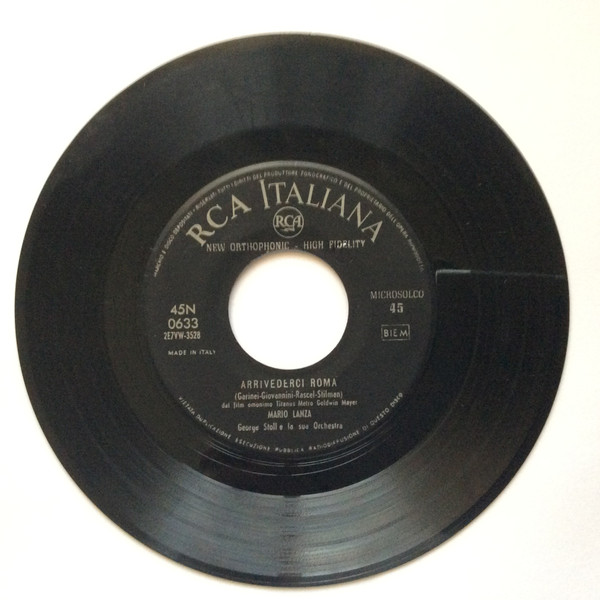

# Arrivederci Roma / It's The Loveliest Night Of The Year

By Mario Lanza

## Album Data

[Discogs URL](https://www.discogs.com/release/3965571-Mario-Lanza-Arrivederci-Roma-/-It's-The-Loveliest-Night-Of-The-Year)

- Catalog #: 45N 0633
- Label: RCA Italiana
- Format: 7", Single
- Rating: 
- Released: 1957
- Release ID: 3965571
- Media condition: Very Good (VG)
- Sleeve condition: 
- Speed: 45 rpm
- Weight: 

## See also

- [Mario Lanza Sings The Hit Songs From The Student Prince](Mario_Lanza_Sings_The_Hit_Songs_From_The_Student_Prince.md)
