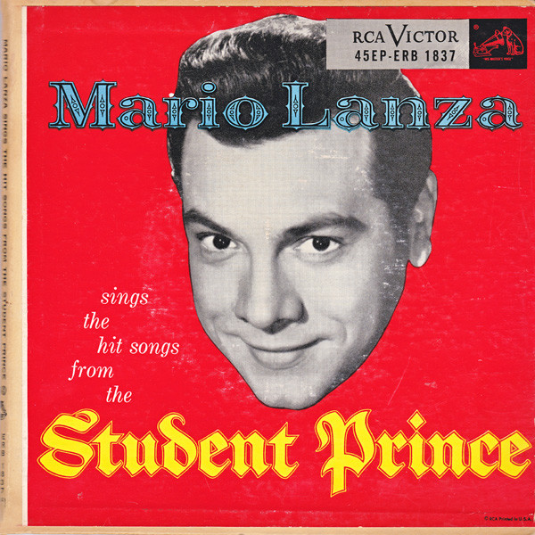

# Mario Lanza Sings The Hit Songs From The Student Prince

By Mario Lanza

## Album Data

[Discogs URL](https://www.discogs.com/release/4650914-Mario-Lanza-Mario-Lanza-Sings-The-Hit-Songs-From-The-Student-Prince)

- Catalog #: ERB 1837, ERB-1837
- Label: RCA Victor Red Seal, RCA Victor Red Seal
- Format: 2x7", Album, EP, Gat
- Rating: 
- Released: 1954
- Release ID: 4650914
- Media condition: 
- Sleeve condition: Very Good Plus (VG+)
- Speed: 
- Weight: 

## Notes

Cover only, no records

## See also

- [Arrivederci Roma / It's The Loveliest Night Of The Year](Arrivederci_Roma_-_Its_The_Loveliest_Night_Of_The_Year.md)
