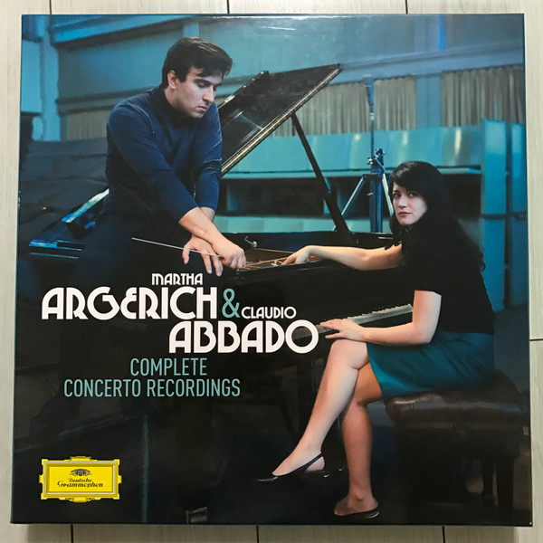

# Complete Concerto Recordings

By Martha Argerich & Claudio Abbado

## Album Data

[Discogs URL](https://www.discogs.com/release/7935882-Martha-Argerich-&-Claudio-Abbado-Complete-Concerto-Recordings)

- Catalog #: 0289 479 4548 2
- Label: Deutsche Grammophon
- Format: 6xLP, Comp, Ltd, RM + Box
- Rating: 
- Released: 2015
- Release ID: 7935882
- Media condition: Mint (M)
- Sleeve condition: Mint (M)
- Speed: 33 rpm
- Weight: 180 gram

