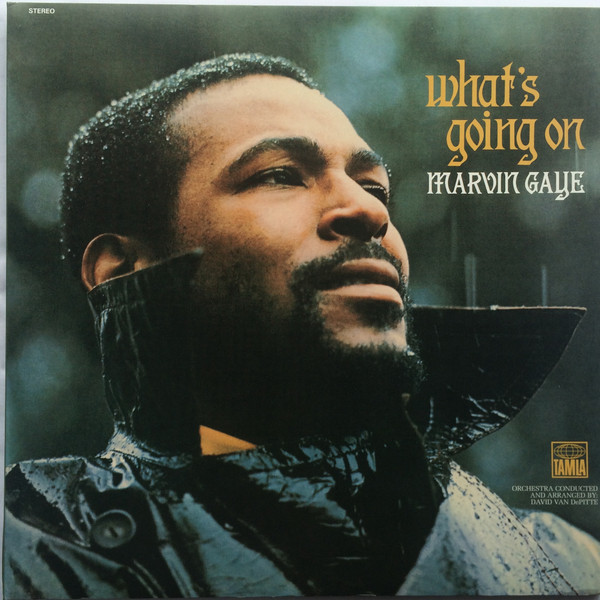

# What's Going On

By Marvin Gaye

## Album Data

[Discogs URL](https://www.discogs.com/release/3005073-Marvin-Gaye-What's-Going-On)

- Catalog #: B0015552-02
- Label: Motown
- Format: LP + CD, Album + CD, Comp + Dlx, 40t
- Rating: 5
- Released: 2011
- Release ID: 3005073
- Media condition: Mint (M)
- Sleeve condition: Mint (M)
- Speed: 33 rpm
- Weight: 180 gram

