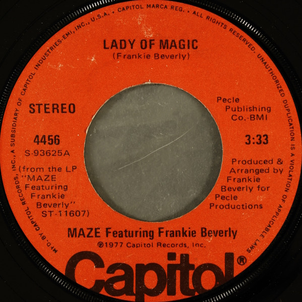

# Lady Of Magic

By Maze Featuring Frankie Beverly

## Album Data

[Discogs URL](https://www.discogs.com/release/3039465-Maze-Featuring-Frankie-Beverly-Lady-Of-Magic)

- Catalog #: 4456
- Label: Capitol Records
- Format: 7", Single, Win
- Rating: 
- Released: 1977
- Release ID: 3039465
- Media condition: Very Good Plus (VG+)
- Sleeve condition: 
- Speed: 45 rpm
- Weight: 

