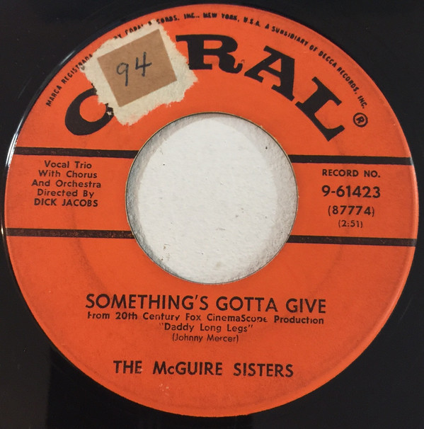

# Something's Gotta Give / Rhythm 'N' Blues

By McGuire Sisters

## Album Data

[Discogs URL](https://www.discogs.com/release/8462916-McGuire-Sisters-Something's-Gotta-Give-/-Rhythm-'N'-Blues)

- Catalog #: 9-61423
- Label: Coral
- Format: 7", Single, Glo
- Rating: 
- Released: 1955
- Release ID: 8462916
- Media condition: Near Mint (NM or M-)
- Sleeve condition: 
- Speed: 45 rpm
- Weight: 

