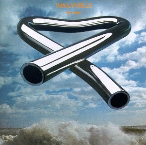

# Tubular Bells

By Mike Oldfield

## Album Data

[Discogs URL](https://www.discogs.com/release/3020834-Mike-Oldfield-Tubular-Bells)

- Catalog #: VR 13-105
- Label: Virgin
- Format: LP, Album, RI
- Rating: 
- Released: 1973
- Release ID: 3020834
- Media condition: Very Good Plus (VG+)
- Sleeve condition: Good Plus (G+)
- Speed: 33 rpm
- Weight: 

## Album Tracks

| **Position** | **Title** | **Duration** |
|--------------|-----------|--------------|
| A | **Tubular Bells** | 25:00 |
| B | **Tubular Bells** | 23:50 |

## Artist Roles

| **Name** | **Role** |
|----------|----------|
| **Mundy Ellis** | Chorus [Girlie] |
| **Sally Oldfield** | Chorus [Girlie] |
| **Mike Oldfield** | Composed By |
| **George Piros** | Lacquer Cut By |
| **Mike Oldfield** | Mixed By [Sound] |
| **Simon Heyworth** | Mixed By [Sound] |
| **Tom Newman (2)** | Mixed By [Sound] |
| **Mike Oldfield** | Organ [Farfisa, Lowrey], Bass, Electric Guitar, Acoustic Guitar |
| **Trevor Key** | Photography, Design [Sleeve] |
| **Mike Oldfield** | Piano [Grand, Honky Tonk], Glockenspiel, Guitar [Speed, Mandolin-like, Fuzz], Electronics [Taped Motor Drive Amplifier Organ Chord], Percussion [Assorted], Flageolet, Tubular Bells |
| **Mike Oldfield** | Piano, Electric Guitar [Speed], Timpani [Concert], Guitar [Sounding Like Bagpipes, Spanish], Vocals [Piltdown Man], Organ [Hammond], Chorus [Moribund], Conductor [Choir] |

## See also

- 
- [Roon: Tubular Beats](../../Roon/Mike_Oldfield/Tubular_Beats.md)
- [Roon: Tubular Bells 2003](../../Roon/Mike_Oldfield/Tubular_Bells_2003.md)
- [Roon: Tubular Bells Digital Box Set](../../Roon/Mike_Oldfield/Tubular_Bells_Digital_Box_Set.md)
