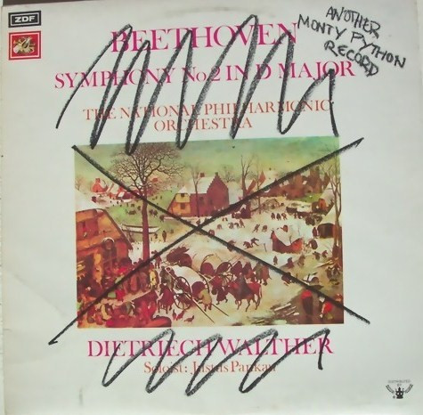

# Another Monty Python Record

By Monty Python

## Album Data

[Discogs URL](https://www.discogs.com/release/1568281-Monty-Python-Another-Monty-Python-Record)

- Catalog #: CAS-1049
- Label: Buddah Records, Charisma
- Formats: Vinyl
- Format: LP
- Rating: 
- Released: 1972
- Year: 1971
- Release ID: 1568281
- Media condition: Very Good Plus (VG+)
- Sleeve condition: Very Good Plus (VG+)
- Speed: 33 rpm
- Weight: 

## Album Tracks

| **Position** | **Title** | **Duration** |
|--------------|-----------|--------------|
| A | **Another Monty Python Record** |  |
| B | **Another Monty Python Record** |  |

## Artist Roles

| **Name** | **Role** |
|----------|----------|
| **The Fred Tomlinson Singers** | Chorus |
| **Tony Taverner** | Engineer |
| **Will Roper** | Engineer |
| **Fred Tomlinson** | Music By |
| **Carol Cleveland** | Performer |
| **Terry Gilliam** | Performer |
| **Eric Idle** | Performer, Written-By |
| **Graham Chapman** | Performer, Written-By |
| **John Cleese** | Performer, Written-By |
| **Michael Palin** | Performer, Written-By |
| **Michael Palin** | Producer |
| **Terry Jones** | Producer |
| **Colin Caldwell** | Recorded By |

## See also

- [I Bet You They Won't Play This Song On The Radio](I_Bet_You_They_Wont_Play_This_Song_On_The_Radio.md)
- [The Monty Python Matching Tie And Handkerchief](The_Monty_Python_Matching_Tie_And_Handkerchief.md)
