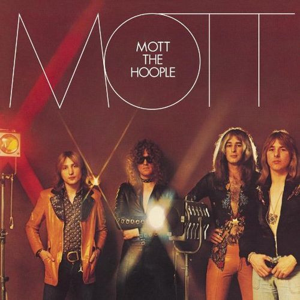

# Mott

By Mott The Hoople

## Album Data

[Discogs URL](https://www.discogs.com/release/9292831-Mott-The-Hoople-Mott)

- Catalog #: DPRLP75
- Label: Drastic Plastic Records
- Format: LP, Album, Ltd, Num, Gat
- Rating: 
- Released: 2016
- Release ID: 9292831
- Media condition: Mint (M)
- Sleeve condition: Mint (M)
- Speed: 33 rpm
- Weight: 200 gram

## Notes

Limited edition numbered copy 150 of 500

## Album Tracks

| **Position** | **Title** | **Duration** |
|--------------|-----------|--------------|
| A1 | **All The Way From Memphis** | 4:58 |
| A2 | **Whizz Kid** | 3:25 |
| A3 | **Hymn For The Dudes** | 5:20 |
| A4 | **Honaloochie Boogie** | 2:42 |
| A5 | **Violence** | 4:49 |
| B1 | **Drivin' Sister** | 3:51 |
| B2 | **Ballad Of Mott The Hopple (March 26, 1972 - Zurich)** | 5:22 |
| B3 | **I'm A Cadillac / El Camino Dolo Roso** | 7:47 |
| B4 | **I Wish I Was Your Mother** | 4:52 |

## See also

- [All The Young Dudes](All_The_Young_Dudes.md)
- [Beets: All The Young Dudes](../../Beets/Mott_The_Hoople/All_The_Young_Dudes.md)
- [Beets: Mott](../../Beets/Mott_The_Hoople/Mott.md)
