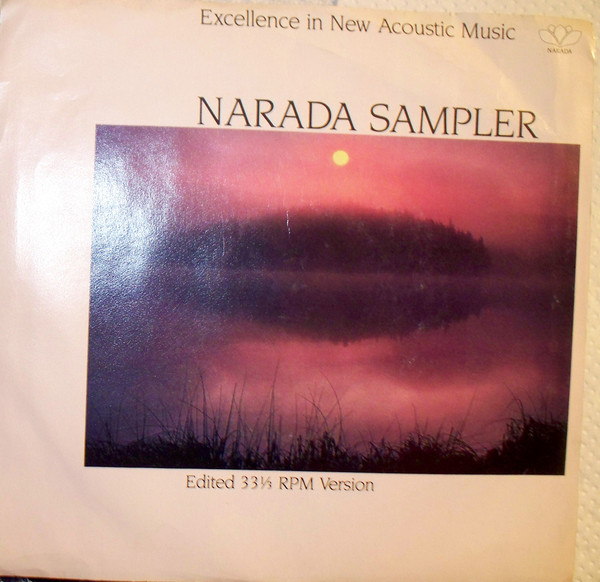

# Sampler

By Narada Artists

## Album Data

[Discogs URL](https://www.discogs.com/release/3410567-Narada-Artists-Sampler)

- Catalog #: S-17254
- Label: Narada
- Format: 7", Promo, Smplr, Rai
- Rating: 
- Released: 1986
- Release ID: 3410567
- Media condition: Very Good Plus (VG+)
- Sleeve condition: Very Good Plus (VG+)
- Speed: 33 rpm
- Weight: 

## Album Tracks

| **Position** | **Title** | **Duration** |
|--------------|-----------|--------------|
| A1 | **Fisherman's Dreams** | 2:03 |
| A2 | **Hillside View** | 1:54 |
| A3 | **Eternal Holly** | 1:31 |
| A4 | **Mexican Memories** | 2:07 |
| B1 | **Mountain Song** | 1:28 |
| B2 | **The Last Snow Leopard** | 2:12 |
| B3 | **Leaves On The Seine** | 1:53 |
| B4 | **Running Dances** | 1:59 |

## See also

- 
