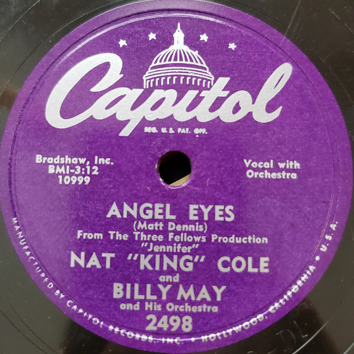

# Angel Eyes

By Nat King Cole and Billy May And His Orchestra

## Album Data

[Discogs URL](https://www.discogs.com/release/8641559-Nat-King-Cole-and-Billy-May-And-His-Orchestra-Angel-Eyes)

- Catalog #: F2498
- Label: Capitol Records
- Formats: Vinyl
- Format: 7", 45 RPM
- Rating: 
- Released: 0
- Year: 1953
- Release ID: 8641559
- Media condition: Very Good Plus (VG+)
- Sleeve condition: 
- Speed: 45 rpm
- Weight: 

## Album Tracks

| **Position** | **Title** | **Duration** |
|--------------|-----------|--------------|
| A | **Angel Eyes** |  |
| B | **Return To Paradise** |  |

## See also

- 
