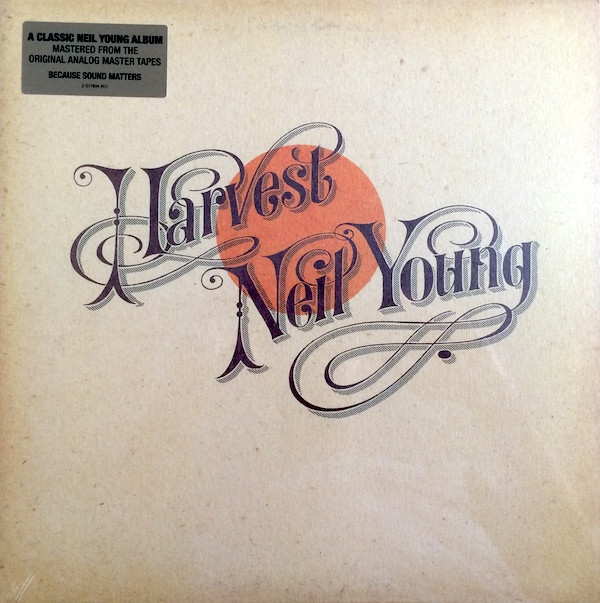

# Harvest

By Neil Young

## Album Data

[Discogs URL](https://www.discogs.com/release/3174466-Neil-Young-Harvest)

- Catalog #: 9362-49786-5
- Label: Reprise Records
- Formats: Vinyl, 180 Gram, Gatefold
- Format: LP, Album, RE, 180
- Rating: 5
- Released: 2009
- Year: 1972
- Release ID: 3174466
- Media condition: Mint (M)
- Sleeve condition: Mint (M)
- Speed: 
- Weight: 

## Album Tracks

| **Position** | **Title** | **Duration** |
|--------------|-----------|--------------|
| A1 | **Out On The Weekend** | 4:32 |
| A2 | **Harvest** | 3:09 |
| A3 | **A Man Needs A Maid** | 4:02 |
| A4 | **Heart Of Gold** | 3:07 |
| A5 | **Are You Ready For The Country?** | 3:24 |
| B1 | **Old Man** | 3:22 |
| B2 | **There's A World** | 2:59 |
| B3 | **Alabama** | 4:02 |
| B4 | **The Needle And The Damage Done** | 2:03 |
| B5 | **Words (Between The Lines Of Age)** | 6:47 |

## Artist Roles

| **Name** | **Role** |
|----------|----------|
| **Tom Wilkes (2)** | Design |
| **Chris Bellman** | Lacquer Cut By |
| **Joel Bernstein** | Photography By |
| **Chris Bellman** | Remastered By |
| **Neil Young** | Written-By |

## See also

- 
- [Beets: After the Gold Rush](../../Beets/Neil_Young/After_the_Gold_Rush.md)
- [Beets: Everybody Knows This Is Nowhere](../../Beets/Neil_Young/Everybody_Knows_This_Is_Nowhere.md)
- [Beets: Harvest](../../Beets/Neil_Young/Harvest.md)
- [Beets: Neil Young](../../Beets/Neil_Young/Neil_Young.md)
- [Beets: On the Beach](../../Beets/Neil_Young/On_the_Beach.md)
- [Beets: Tonight’s the Night](../../Beets/Neil_Young/Tonight’s_the_Night.md)
- [Roon: After The Gold Rush (50th Anniversary)](../../Roon/Neil_Young/After_The_Gold_Rush_50th_Anniversary.md)
- [Roon: Barn](../../Roon/Neil_Young/Barn.md)
- [Roon: Decade](../../Roon/Neil_Young/Decade.md)
- [Roon: Everybody Knows This Is Nowhere](../../Roon/Neil_Young/Everybody_Knows_This_Is_Nowhere.md)
- [Roon: Harvest](../../Roon/Neil_Young/Harvest.md)
- [Roon: Neil Young Archives Vol. II (1972 - 1976)](../../Roon/Neil_Young/Neil_Young_Archives_Vol_II_1972_-_1976.md)
- [Roon: Neil Young Archives Volume I [1963 - 1972] (DMD Album)](../../Roon/Neil_Young/Neil_Young_Archives_Volume_I_[1963_-_1972]_DMD_Album.md)
- [Roon: Psychedelic Pill](../../Roon/Neil_Young/Psychedelic_Pill.md)
- [Roon: Rust Never Sleeps (2016 Remaster)](../../Roon/Neil_Young/Rust_Never_Sleeps_2016_Remaster.md)
- [Roon: Sleeps with Angels](../../Roon/Neil_Young/Sleeps_with_Angels.md)
- [Roon: The Visitor](../../Roon/Neil_Young/The_Visitor.md)
- [Roon: Tonight's The Night](../../Roon/Neil_Young/Tonights_The_Night.md)
- [Roon: Way Down In The Rust Bucket (Live)](../../Roon/Neil_Young/Way_Down_In_The_Rust_Bucket_Live.md)
- [Roon: Zuma (2016 Remaster)](../../Roon/Neil_Young/Zuma_2016_Remaster.md)
