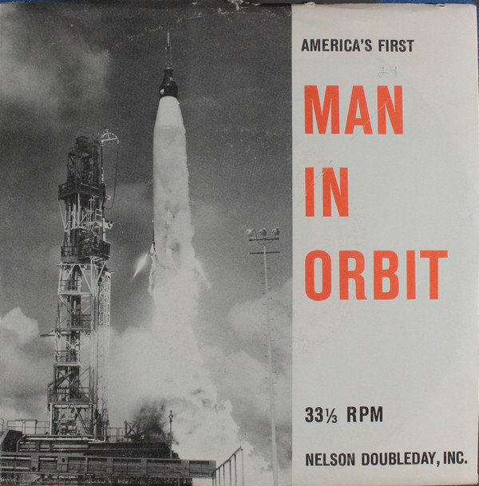

# America's First Man In Orbit

By No Artist

## Album Data

[Discogs URL](https://www.discogs.com/release/1095339-No-Artist-America's-First-Man-In-Orbit)

- Catalog #: SP 27
- Label: Nelson Doubleday, Inc.
- Formats: Vinyl, Compatible Stereo
- Format: 7", Com, 33 ⅓ RPM
- Rating: 
- Released: 0
- Year: 0
- Release ID: 1095339
- Media condition: Very Good Plus (VG+)
- Sleeve condition: Very Good (VG)
- Speed: 45 rpm
- Weight: 

## Album Tracks

| **Position** | **Title** | **Duration** |
|--------------|-----------|--------------|
| A | **America's First Man In Orbit (Side 1)** |  |
| B | **America's First Man In Orbit (Side 2)** |  |

## Artist Roles

| **Name** | **Role** |
|----------|----------|
| **Lt. Col. John A. Powers** | Narrator |
| **Ward Botsford** | Producer |

## See also

- [Bird Songs In Your Garden](Bird_Songs_In_Your_Garden.md)
