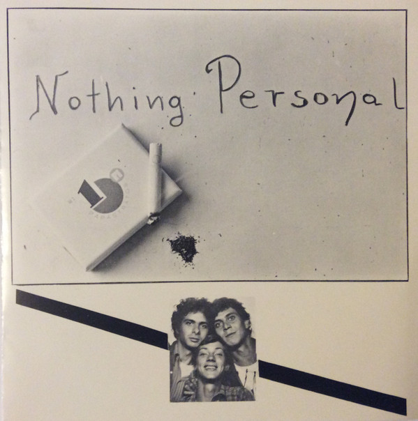

# Bon'g Da Lejje

By Nothing Personal

## Album Data

[Discogs URL](https://www.discogs.com/release/9770072-Nothing-Personal-Bon'g-Da-Lejje)

- Catalog #: 010414
- Label: Riclou Anθhσia Records
- Formats: Vinyl
- Format: 7", Single, 45 RPM
- Rating: 
- Released: 1981
- Year: null
- Release ID: 9770072
- Media condition: Very Good Plus (VG+)
- Sleeve condition: Very Good Plus (VG+)
- Speed: 45 rpm
- Weight: 

## Album Tracks

| **Position** | **Title** | **Duration** |
|--------------|-----------|--------------|
| A | **Bon'g Da Lejje** |  |
| B | **On My Blok** |  |

## See also

- 
