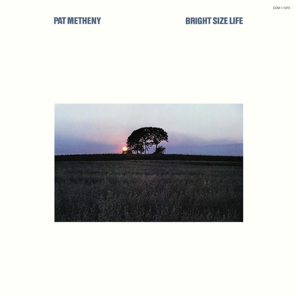

# Bright Size Life

By Pat Metheny

## Album Data

[Discogs URL](https://www.discogs.com/release/2136572-Pat-Metheny-Bright-Size-Life)

- Catalog #: ECM-1-1073
- Label: ECM Records
- Format: LP, Album, RE, Wak
- Rating: 
- Released: 0
- Release ID: 2136572
- Media condition: Very Good Plus (VG+)
- Sleeve condition: Very Good Plus (VG+)
- Speed: 33 rpm
- Weight: 

## Album Tracks

| **Position** | **Title** | **Duration** |
|--------------|-----------|--------------|
| A1 | **Bright Size Life** | 4:45 |
| A2 | **Sirabhorn** | 5:27 |
| A3 | **Unity Village** | 3:38 |
| A4 | **Missouri Uncompromised** | 4:13 |
| B1 | **Midwestern Nights Dream** | 6:00 |
| B2 | **Unquity Road** | 3:36 |
| B3 | **Omaha Celebration** | 4:17 |
| B4 | **Round Trip / Broadway Blues** | 4:58 |

## Artist Roles

| **Name** | **Role** |
|----------|----------|
| **Pat Metheny** | Acoustic Guitar [6-String], Electric Guitar [12-String] |
| **Jaco Pastorius** | Bass |
| **Pat Metheny** | Composed By |
| **Bob Moses** | Drums |
| **Martin Wieland** | Engineer |
| **John Bittner** | Lacquer Cut By |
| **Dieter Bonhorst** | Layout |
| **Gary Burton** | Liner Notes |
| **Roger Seibel** | Mastered By |
| **Tim Hines (4)** | Mastered By |
| **Roberto Masotti** | Photography By [Back Cover] |
| **Rainer Kiedrowski** | Photography By [Cover] |
| **Manfred Eicher** | Producer |

## See also

- 
