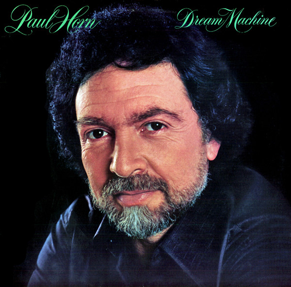

# Dream Machine

By Paul Horn

## Album Data

[Discogs URL](https://www.discogs.com/release/514352-Paul-Horn-Dream-Machine)

- Catalog #: MRS-5010
- Label: Mushroom Records (5)
- Formats: Vinyl, Santa Maria Pressing
- Format: LP, Album, San
- Rating: 
- Released: 1978
- Year: 1978
- Release ID: 514352
- Media condition: Very Good Plus (VG+)
- Sleeve condition: Very Good Plus (VG+)
- Speed: 33 rpm
- Weight: 

## Album Tracks

| **Position** | **Title** | **Duration** |
|--------------|-----------|--------------|
| A1 | **Undercurrents** | 5:39 |
| A2 | **Dream Machine** | 8:04 |
| A3 | **Vera Cruz** | 7:42 |
| B1 | **Witch Doctor** | 6:35 |
| B2 | **Quite Early One Morning** | 8:13 |
| B3 | **The Juggler** | 5:53 |

## Artist Roles

| **Name** | **Role** |
|----------|----------|
| **Abraham Laboriel** | Bass |
| **Lalo Schifrin** | Composed By, Arranged By, Conductor [Conducted By] |
| **Israel Baker** | Concertmaster [Concert Master] |
| **Buck Davis** | Coordinator [Art Coordination] |
| **Jim Keltner** | Drums |
| **Don Henderson** | Engineer [Assistant Engineer] |
| **Paul Horn** | Executive-Producer |
| **Paul Horn** | Flute, Alto Flute |
| **Dean Parks** | Guitar |
| **Charles Loper** | Horns |
| **Chuck Findley** | Horns |
| **Ernie Watts** | Horns |
| **Jim Horn** | Horns |
| **Oscar Brashear** | Horns |
| **Clark Spangler** | Keyboards, Synthesizer [Synth] |
| **Joe Sample** | Keyboards, Synthesizer [Synth] |
| **Lalo Schifrin** | Keyboards, Synthesizer [Synth] |
| **Mike Melvoin** | Keyboards, Synthesizer [Synth] |
| **P. F. T.** | Layout [Back Panel Layout], Design |
| **Mike Reese** | Mastered By |
| **Emil Richards** | Percussion |
| **Paulinho Da Costa** | Percussion |
| **Robin Horn** | Percussion |
| **Bob Levy (4)** | Photography By [Front Cover Photo By] |
| **Buddy Rosenberg** | Photography By [Front Cover Photo By] |
| **Al Schmitt** | Producer |
| **Buck Davis** | Producer [Production Assistant] |
| **Rick Ruggieri** | Recorded By, Mixed By |

## See also

- [Inside](Inside.md)
