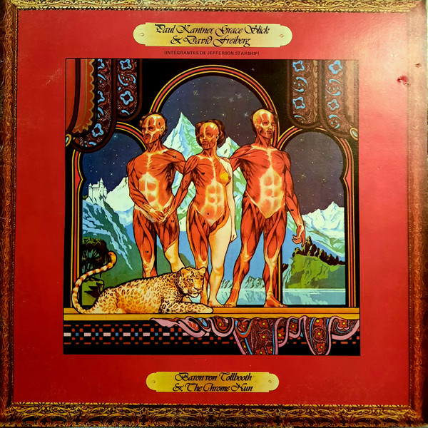

# Baron Von Tollbooth & The Chrome Nun

By "Paul Kantner, Grace Slick & David Freiberg"

## Album Data

[Discogs URL](https://www.discogs.com/release/2588911-"Paul-Kantner,-Grace-Slick-&-David-Freiberg"-Baron-Von-Tollbooth-&-The-Chrome-Nun)

- Catalog #: BFL1-0148
- Label: Grunt (3)
- Format: LP, Album
- Rating: 
- Released: 1973
- Release ID: 2588911
- Media condition: Good Plus (G+)
- Sleeve condition: Fair (F)
- Speed: 33 rpm
- Weight: 

## Album Tracks

| **Position** | **Title** | **Duration** |
|--------------|-----------|--------------|
| A1 | **Ballad Of The Chrome Nun** | 3:59 |
| A2 | **Fat** | 3:13 |
| A3 | **Flowers Of The Night** | 4:13 |
| A4 | **Walkin** | 2:31 |
| A5 | **Your Mind Has Left Your Body** | 5:45 |
| B1 | **Across The Board** | 4:34 |
| B2 | **Harp Tree Lament** | 3:34 |
| B3 | **White Boy** | 4:13 |
| B4 | **Fishman** | 2:40 |
| B5 | **Sketches Of China** | 5:13 |

## See also

- 
