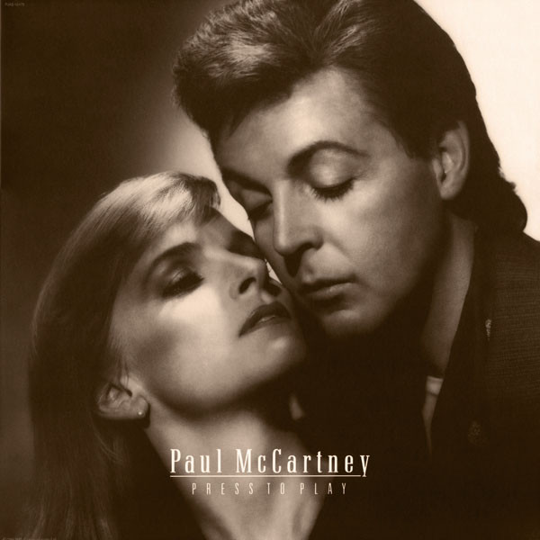

# Press To Play

By Paul McCartney

## Album Data

[Discogs URL](https://www.discogs.com/release/395237-Paul-McCartney-Press-To-Play)

- Catalog #: PJAS-12475
- Label: Capitol Records, MPL (2)
- Format: LP, Album, Gat
- Rating: 
- Released: 1986
- Release ID: 395237
- Media condition: Very Good Plus (VG+)
- Sleeve condition: Very Good Plus (VG+)
- Speed: 33 rpm
- Weight: 

## Album Tracks

| **Position** | **Title** | **Duration** |
|--------------|-----------|--------------|
| A1 | **Stranglehold** | 3:36 |
| A2 | **Good Times Coming/Feel The Sun** | 4:57 |
| A3 | **Talk More Talk** | 5:18 |
| A4 | **Footprints** | 4:33 |
| A5 | **Only Love Remains** | 4:13 |
| B1 | **Press** | 4:41 |
| B2 | **Pretty Little Head** | 5:14 |
| B3 | **Move Over Busker** | 4:07 |
| B4 | **Angry** | 3:35 |
| B5 | **However Absurd** | 5:00 |

## Artist Roles

| **Name** | **Role** |
|----------|----------|
| **Eric Stewart** | Harmony Vocals |
| **Kate Robbins** | Harmony Vocals |
| **Linda McCartney** | Harmony Vocals |
| **Ruby James** | Harmony Vocals |
| **George Hurrell** | Photography By |
| **Paul McCartney** | Producer |
| **Hugh Padgham** | Producer, Engineer, Mixed By |

## See also

- [McCartney](McCartney.md)
- [Beets: All the Best](../../Beets/Paul_McCartney/All_the_Best.md)
- [Beets: McCartney](../../Beets/Paul_McCartney/McCartney.md)
- [Beets: Memory Almost Full](../../Beets/Paul_McCartney/Memory_Almost_Full.md)
- [Beets: New](../../Beets/Paul_McCartney/New.md)
- [Beets: Pure McCartney](../../Beets/Paul_McCartney/Pure_McCartney.md)
- [Beets: RAM](../../Beets/Paul_McCartney/RAM_2.md)
- [Beets: RAM](../../Beets/Paul_McCartney/RAM.md)
- [CD: Mccartney](../../CD/Paul_McCartney/Mccartney.md)
- [CD: ](../../CD/Paul_McCartney/Paul_McCartney.md)
- [CD: Ram](../../CD/Paul_McCartney/Ram.md)
- [Roon: Band On The Run](../../Roon/Paul_McCartney/Band_On_The_Run.md)
- [Roon: McCartney (Archive Collection)](../../Roon/Paul_McCartney/McCartney_Archive_Collection.md)
- [Roon: NEW (Deluxe Edition)](../../Roon/Paul_McCartney/NEW_Deluxe_Edition.md)
- [Roon: Pure McCartney](../../Roon/Paul_McCartney/Pure_McCartney.md)
- [Roon: Ram (Archive Collection)](../../Roon/Paul_McCartney/Ram_Archive_Collection.md)
- [Roon: Wings At The Speed Of Sound (Archive Collection)](../../Roon/Paul_McCartney/Wings_At_The_Speed_Of_Sound_Archive_Collection.md)
- [Roon: Wings Over America (Live / Remastered)](../../Roon/Paul_McCartney/Wings_Over_America_Live_-_Remastered.md)
- [Roon: Wingspan](../../Roon/Paul_McCartney/Wingspan.md)
