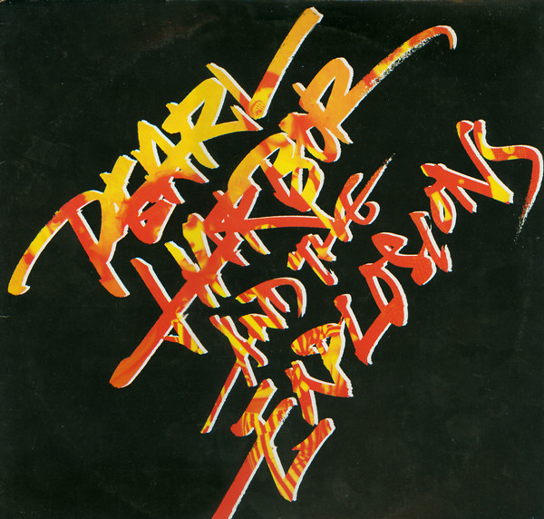

# Pearl Harbor And The Explosions

By Pearl Harbor And The Explosions

## Album Data

[Discogs URL](https://www.discogs.com/release/890551-Pearl-Harbor-And-The-Explosions-Pearl-Harbor-And-The-Explosions)

- Catalog #: WB 56 769
- Label: Warner Bros. Records
- Format: LP, Album
- Rating: 
- Released: 1980
- Release ID: 890551
- Media condition: Very Good Plus (VG+)
- Sleeve condition: Very Good Plus (VG+)
- Speed: 33 rpm
- Weight: 

## Album Tracks

| **Position** | **Title** | **Duration** |
|--------------|-----------|--------------|
| A1 | **Drivin'** | 4:34 |
| A2 | **You Got It (Release It)** | 2:29 |
| A3 | **Don't Come Back** | 3:30 |
| A4 | **Keep Going** | 3:21 |
| A5 | **Shut Up And Dance** | 4:00 |
| B1 | **The Big One** | 4:06 |
| B2 | **So Much For Love** | 3:01 |
| B3 | **Get A Grip On Yourself** | 3:30 |
| B4 | **Up And Over** | 5:51 |

## See also

- 
