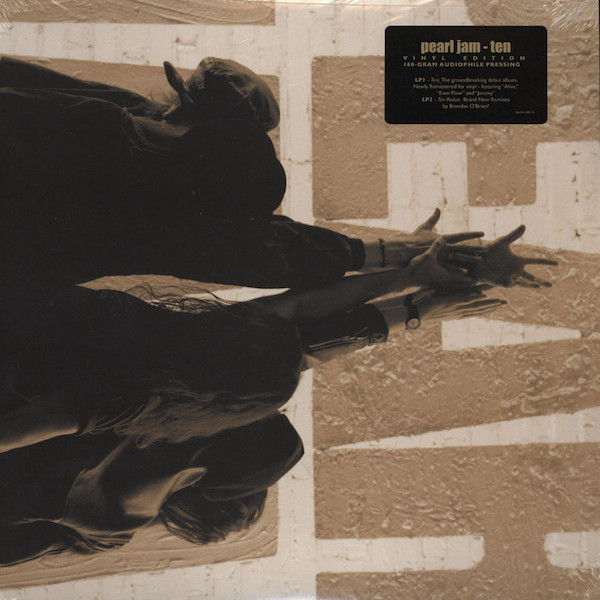

# Ten

By Pearl Jam

## Album Data

[Discogs URL](https://www.discogs.com/release/1704831-Pearl-Jam-Ten)

- Catalog #: 88697413021
- Label: Epic, Legacy
- Format: LP, Album + LP, Album + RE, RM, 180
- Rating: 
- Released: 2009
- Release ID: 1704831
- Media condition: Mint (M)
- Sleeve condition: Mint (M)
- Speed: 33 rpm
- Weight: 180 gram

## Album Tracks

| **Position** | **Title** | **Duration** |
|--------------|-----------|--------------|
|  | **Ten** |  |
| A1 | **Once** |  |
| A2 | **Even Flow** |  |
| A3 | **Alive** |  |
| A4 | **Why Go** |  |
| A5 | **Black** |  |
| A6 | **Jeremy** |  |
| B1 | **Oceans** |  |
| B2 | **Porch** |  |
| B3 | **Garden** |  |
| B4 | **Deep** |  |
| B5 | **Release** |  |
|  | **Ten Redux** |  |
| C1 | **Once** |  |
| C2 | **Even Flow** |  |
| C3 | **Alive** |  |
| C4 | **Why Go** |  |
| C5 | **Black** |  |
| C6 | **Jeremy** |  |
| D1 | **Oceans** |  |
| D2 | **Porch** |  |
| D3 | **Garden** |  |
| D4 | **Deep** |  |
| D5 | **Release** |  |

## Artist Roles

| **Name** | **Role** |
|----------|----------|
| **Michael Goldstone** | A&R |
| **Andy Fischer** | Art Direction, Artwork [Concept], Design |
| **Eddie Vedder** | Art Direction, Artwork [Concept], Design |
| **Jeff Ament** | Art Direction, Artwork [Concept], Design |
| **Eddie Vedder** | Artwork [Additional Art] |
| **Steve Pitstick** | Artwork [Additional Art] |
| **Jeff Ament** | Bass [Basses] |
| **Walter Gray** | Cello |
| **Dave Krusen** | Drums |
| **Nick Didia** | Engineer |
| **Adrian Moore (3)** | Engineer [Additional Engineering] |
| **Billy Bowers** | Engineer [Additional Engineering] |
| **Dave Hillis** | Engineer [Additional Engineering] |
| **Don Gilmore** | Engineer [Additional Engineering] |
| **Darren Tablan** | Engineer [Assistant] |
| **Tom Tapley** | Engineer [Assistant] |
| **Mike McCready** | Guitar [Guitars] |
| **Stone Gossard** | Guitar [Guitars] |
| **Wes Garland** | Lacquer Cut By |
| **Richard Leher** | Legal [Attorney] |
| **Eddie Vedder** | Lyrics By |
| **Kelly Curtis** | Management |
| **Don Muller** | Management [Agent, Triad] |
| **Bob Ludwig** | Mastered By |
| **Tim Palmer** | Mixed By |
| **Dave Krusen** | Music By |
| **Eddie Vedder** | Music By |
| **Jeff Ament** | Music By |
| **Mike McCready** | Music By |
| **Stone Gossard** | Music By |
| **Tim Palmer** | Performer [Fire Extinguisher, Pepper Shaker] |
| **Lance Mercer** | Photography By [Photos] |
| **Rick Parashar** | Piano, Organ, Percussion |
| **Pearl Jam** | Producer |
| **Rick Parashar** | Producer |
| **Bob Ludwig** | Remastered By [2008] |
| **Brendan O'Brien** | Remix |
| **Eddie Vedder** | Vocals |

## See also

- 
- [Beets: Ten](../../Beets/Pearl_Jam/Ten.md)
- [CD: Greatest Hits](../../CD/Pearl_Jam/Greatest_Hits.md)
- [CD: ](../../CD/Pearl_Jam/Pearl_Jam.md)
