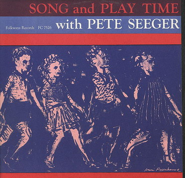

# Song And Play Time

By Pete Seeger

## Album Data

[Discogs URL](https://www.discogs.com/release/1945248-Pete-Seeger-Song-And-Play-Time)

- Catalog #: FC 7526
- Label: Folkways Records
- Formats: Vinyl
- Format: LP, Album
- Rating: 
- Released: 1960
- Year: 1960
- Release ID: 1945248
- Media condition: Very Good Plus (VG+)
- Sleeve condition: Generic
- Speed: 33 rpm
- Weight: 

## Album Tracks

| **Position** | **Title** | **Duration** |
|--------------|-----------|--------------|
| A1 | **Go In And Out The Window** |  |
| A2 | **Here We Go Luby-Loo** |  |
| A3 | **She'll Be Coming Around The Mountain** |  |
| A4 | **Skip To My Lou** |  |
| A5 | **Mary Wore Her Red Dress** |  |
| A6 | **Little Sally Walker** |  |
| A7 | **I've Been Working On The Railroad** |  |
| A8 | **I Wonder What Tinya Is Doing** |  |
| B1 | **Soon As We All Cook Sweet Potatoes** |  |
| B2 | **Let Us Come In** |  |
| B3 | **Bob-A-Needle** |  |
| B4 | **Captain Jinks** |  |
| B5 | **Going To Boston** |  |
| B6 | **Red Bird** |  |
| B7 | **Ha Ha This Away** |  |
| B8 | **Bobby's Three Years Old Today** |  |

## Artist Roles

| **Name** | **Role** |
|----------|----------|
| **Irwin Rosenhouse** | Illustration |
| **David Hancock** | Lacquer Cut By |

## See also

- 
