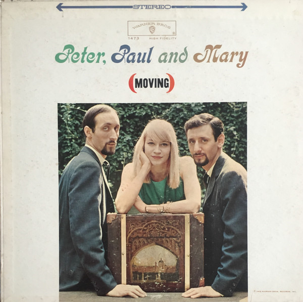

# (Moving)

By "Peter, Paul & Mary"

## Album Data

[Discogs URL](https://www.discogs.com/release/4672397-"Peter,-Paul-&-Mary"-(Moving))

- Catalog #: WS 1473, WS1473
- Label: Warner Bros. Records, Warner Bros. Records
- Formats: Vinyl
- Format: LP, Album
- Rating: 
- Released: 1963
- Year: 1963
- Release ID: 4672397
- Media condition: Very Good Plus (VG+)
- Sleeve condition: Very Good Plus (VG+)
- Speed: 33 rpm
- Weight: 

## Album Tracks

| **Position** | **Title** | **Duration** |
|--------------|-----------|--------------|
| A1 | **Settle Down (Goin' Down That Highway)** |  |
| A2 | **Gone The Rainbow** |  |
| A3 | **Flora** |  |
| A4 | **Pretty Mary** |  |
| A5 | **Puff** |  |
| A6 | **This Land Is Your Land** |  |
| B1 | **Man Come Into Egypt** |  |
| B2 | **Old Coat** |  |
| B3 | **Tiny Sparrow** |  |
| B4 | **Big Boat** |  |
| B5 | **Morning Train** |  |
| B6 | **A'soalin'** |  |

## Artist Roles

| **Name** | **Role** |
|----------|----------|
| **Bill Schwartau** | Engineer [Recording] |
| **John Court** | Liner Notes |
| **Milton Okun** | Music Director [Musical Director] |
| **Barry Feinstein** | Photography By [Back] |
| **Bernard Cole** | Photography By [Front] |
| **Albert B. Grossman** | Producer |

## See also

- ["Peter, Paul And Mary"](Peter__Paul_And_Mary.md)
