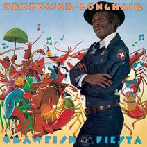

# Crawfish Fiesta

By Professor Longhair

## Album Data

[Discogs URL](https://www.discogs.com/release/4036468-Professor-Longhair-Crawfish-Fiesta)

- Catalog #: AL 4718
- Label: Alligator Records
- Format: LP, Album, RE, RM, 180
- Rating: 
- Released: 2012
- Release ID: 4036468
- Media condition: Mint (M)
- Sleeve condition: Mint (M)
- Speed: 33 rpm
- Weight: 180 gram

## Album Tracks

| **Position** | **Title** | **Duration** |
|--------------|-----------|--------------|
| A1 | **Big Chief** | 3:13 |
| A2 | **Her Mind Is Gone** | 4:23 |
| A3 | **Something On Your Mind** | 4:10 |
| A4 | **You're Driving Me Crazy** | 2:34 |
| A5 | **Red Beans** | 4:09 |
| A6 | **Willie Fugal's Blues** | 2:03 |
| B1 | **It's My Fault, Darling** | 4:54 |
| B2 | **In The Wee Wee Hours** | 3:23 |
| B3 | **Cry To Me** | 3:35 |
| B4 | **Bald Head** | 2:58 |
| B5 | **Whole Lotta Loving** | 3:46 |
| B6 | **Crawfish Fiesta** | 3:10 |
| B7 | **River's Invitation** | 3:14 |

## See also

- ["Go To The Mardi Gras / Everyday, Everynight"](Go_To_The_Mardi_Gras_-_Everyday__Everynight.md)
- [New Orleans Piano](New_Orleans_Piano.md)
