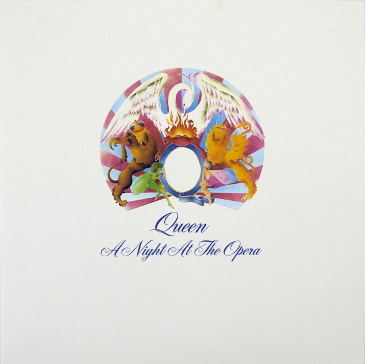

# A Night At The Opera

By Queen

## Album Data

[Discogs URL](https://www.discogs.com/release/1361079-Queen-A-Night-At-The-Opera)

- Catalog #: 7E-1053
- Label: Elektra
- Formats: Vinyl, CSM, Gatefold
- Format: LP, Album, CSM, Stereo
- Rating: 
- Released: 1975
- Year: 1975
- Release ID: 1361079
- Media condition: Very Good Plus (VG+)
- Sleeve condition: Very Good Plus (VG+)
- Speed: 33 rpm
- Weight: 

## Album Tracks

| **Position** | **Title** | **Duration** |
|--------------|-----------|--------------|
| A1 | **Death On Two Legs (Dedicated To....)** | 3:43 |
| A2 | **Lazing On A Sunday Afternoon** | 1:08 |
| A3 | **I'm In Love With My Car** | 3:05 |
| A4 | **You're My Best Friend** | 2:50 |
| A5 | **'39** | 3:25 |
| A6 | **Sweet Lady** | 4:01 |
| A7 | **Seaside Rendezvous** | 2:13 |
| B1 | **The Prophet's Song** | 8:17 |
| B2 | **Love Of My Life** | 3:38 |
| B3 | **Good Company** | 3:26 |
| B4 | **Bohemian Rhapsody** | 5:55 |
| B5 | **God Save The Queen** | 1:11 |

## Artist Roles

| **Name** | **Role** |
|----------|----------|
| **David Costa** | Art Direction |
| **Queen** | Composed By, Arranged By, Performer [Performed By] |
| **John Deacon** | Electric Bass |
| **Mike Stone** | Engineer [Executive] |
| **Gary Lyons** | Engineer [Invaluable Additional Engineering] |
| **Brian May** | Guitar, Guitar [Orchestral Backdrops] |
| **Terry Dunavan** | Lacquer Cut By |
| **John Reid (8)** | Management |
| **John Harris** | Other [Equipment Supervision] |
| **Roger Taylor** | Percussion |
| **Queen** | Producer |
| **Roy Thomas Baker** | Producer |
| **Freddie Mercury** | Vocals, Piano [Bechstein Debauchery] |
| **Brian May** | Written-By |
| **Freddie Mercury** | Written-By |
| **John Deacon** | Written-By |
| **Roger Taylor** | Written-By |

## See also

- [Another One Bites The Dust](Another_One_Bites_The_Dust.md)
- [News Of The World](News_Of_The_World.md)
- [Queen II](Queen_II.md)
- [Queen](Queen.md)
- [We Are The Champions](We_Are_The_Champions.md)
- [Beets: Greatest Hits](../../Beets/Queen/Greatest_Hits.md)
- [Beets: News Of The World (Deluxe Edition)](../../Beets/Queen/News_Of_The_World_Deluxe_Edition.md)
- [Beets: News of the World](../../Beets/Queen/News_of_the_World.md)
- [Beets: Queen II](../../Beets/Queen/Queen_II.md)
- [Roon: A Night at the Opera (Remastered 2011)](../../Roon/Queen/A_Night_at_the_Opera_Remastered_2011.md)
- [Roon: Greatest Hits](../../Roon/Queen/Greatest_Hits.md)
- [Roon: News Of The World (Deluxe Remastered Version)](../../Roon/Queen/News_Of_The_World_Deluxe_Remastered_Version.md)
- [Roon: News Of The World](../../Roon/Queen/News_Of_The_World.md)
- [Roon: Queen II (Remastered 2011)](../../Roon/Queen/Queen_II_Remastered_2011.md)
