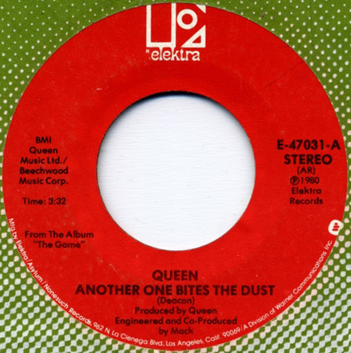

# Another One Bites The Dust

By Queen

## Album Data

[Discogs URL](https://www.discogs.com/release/3240510-Queen-Another-One-Bites-The-Dust)

- Catalog #: E-47031
- Label: Elektra
- Formats: Vinyl, AR
- Format: 7", Single, Styrene, AR
- Rating: 
- Released: 1980
- Year: 1980
- Release ID: 3240510
- Media condition: Very Good (VG)
- Sleeve condition: 
- Speed: 45 rpm
- Weight: 

## Album Tracks

| **Position** | **Title** | **Duration** |
|--------------|-----------|--------------|
| A | **Another One Bites The Dust** | 3:32 |
| B | **Don't Try Suicide** | 3:50 |

## Artist Roles

| **Name** | **Role** |
|----------|----------|
| **Mack (2)** | Engineer, Co-producer |
| **Queen** | Producer |

## See also

- [A Night At The Opera](A_Night_At_The_Opera.md)
- [News Of The World](News_Of_The_World.md)
- [Queen II](Queen_II.md)
- [Queen](Queen.md)
- [We Are The Champions](We_Are_The_Champions.md)
- [Beets: Greatest Hits](../../Beets/Queen/Greatest_Hits.md)
- [Beets: News Of The World (Deluxe Edition)](../../Beets/Queen/News_Of_The_World_Deluxe_Edition.md)
- [Beets: News of the World](../../Beets/Queen/News_of_the_World.md)
- [Beets: Queen II](../../Beets/Queen/Queen_II.md)
- [Roon: A Night at the Opera (Remastered 2011)](../../Roon/Queen/A_Night_at_the_Opera_Remastered_2011.md)
- [Roon: Greatest Hits](../../Roon/Queen/Greatest_Hits.md)
- [Roon: News Of The World (Deluxe Remastered Version)](../../Roon/Queen/News_Of_The_World_Deluxe_Remastered_Version.md)
- [Roon: News Of The World](../../Roon/Queen/News_Of_The_World.md)
- [Roon: Queen II (Remastered 2011)](../../Roon/Queen/Queen_II_Remastered_2011.md)
