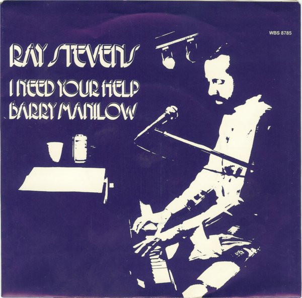

# I Need Your Help Barry Manilow

By Ray Stevens

## Album Data

[Discogs URL](https://www.discogs.com/release/1835117-Ray-Stevens-I-Need-Your-Help-Barry-Manilow)

- Catalog #: WBS 8785
- Label: Warner Bros. Records
- Formats: Vinyl, Los Angeles pressing
- Format: 7", Los, 45 RPM, Stereo
- Rating: 
- Released: 1979
- Year: 1979
- Release ID: 1835117
- Media condition: Very Good Plus (VG+)
- Sleeve condition: Near Mint (NM or M-)
- Speed: 45 rpm
- Weight: 

## Album Tracks

| **Position** | **Title** | **Duration** |
|--------------|-----------|--------------|
| A | **I Need Your Help Barry Manilow** | 3:44 |
| B | **Daydream Romance** | 3:35 |

## Artist Roles

| **Name** | **Role** |
|----------|----------|
| **Ray Stevens** | Producer, Arranged By |

## See also

- 
- [Beets: Unknown Album](../../Beets/Ray_Stevens/Unknown_Album.md)
