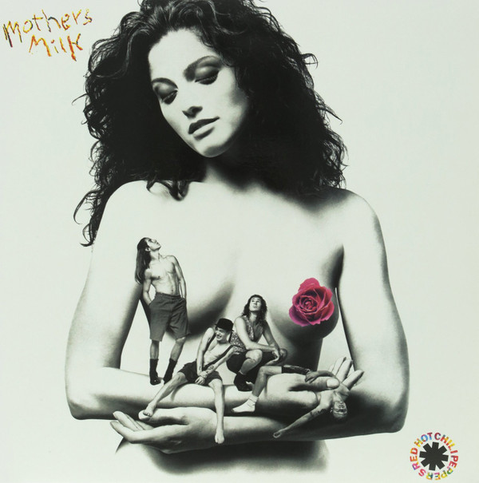

# Mother's Milk

By Red Hot Chili Peppers

## Album Data

[Discogs URL](https://www.discogs.com/release/1828402-Red-Hot-Chili-Peppers-Mother's-Milk)

- Catalog #: 509996 98172 12
- Label: EMI USA
- Format: LP, Album, Ltd, RE, 180
- Rating: 
- Released: 2009
- Release ID: 1828402
- Media condition: Mint (M)
- Sleeve condition: Mint (M)
- Speed: 33 rpm
- Weight: 180 gram

## Album Tracks

| **Position** | **Title** | **Duration** |
|--------------|-----------|--------------|
| A1 | **Good Time Boys** | 4:51 |
| A2 | **Higher Ground** | 3:15 |
| A3 | **Subway To Venus** | 4:17 |
| A4 | **Magic Johnson** | 2:47 |
| A5 | **Nobody Weird Like Me** | 3:45 |
| A6 | **Knock Me Down** | 4:35 |
| B1 | **Taste The Pain** | 4:20 |
| B2 | **Stone Cold Bush** | 2:58 |
| B3 | **Fire** | 2:20 |
| B4 | **Pretty Little Ditty (re-release version)** | 3:07 |
| B5 | **Punk Rock Classic** | 1:37 |
| B6 | **Sexy Mexican Maid** | 3:40 |
| B7 | **Johnny, Kick A Hole In The Sky** | 5:08 |

## Artist Roles

| **Name** | **Role** |
|----------|----------|
| **Ron McMaster** | Lacquer Cut By |
| **Dave Jerden** | Mixed By |
| **Michael Beinhorn** | Producer |
| **D.H. Peligro** | Written-By |
| **Red Hot Chili Peppers** | Written-By |

## See also

- [Freaky Styley](Freaky_Styley.md)
- [Stadium Arcadium](Stadium_Arcadium.md)
- [Beets: By the Way](../../Beets/Red_Hot_Chili_Peppers/By_the_Way.md)
- [Beets: Californication (Bonus Version)](../../Beets/Red_Hot_Chili_Peppers/Californication_Bonus_Version.md)
- [Beets: Californication](../../Beets/Red_Hot_Chili_Peppers/Californication.md)
- [Beets: I’m With You](../../Beets/Red_Hot_Chili_Peppers/I’m_With_You.md)
- [Beets: Mother’s Milk](../../Beets/Red_Hot_Chili_Peppers/Mother’s_Milk.md)
- [Beets: One Hot Minute](../../Beets/Red_Hot_Chili_Peppers/One_Hot_Minute.md)
- [Beets: Red Hot Chili Peppers](../../Beets/Red_Hot_Chili_Peppers/Red_Hot_Chili_Peppers.md)
- [Beets: Stadium Arcadium](../../Beets/Red_Hot_Chili_Peppers/Stadium_Arcadium_2.md)
- [Beets: Stadium Arcadium](../../Beets/Red_Hot_Chili_Peppers/Stadium_Arcadium.md)
- [Beets: The Getaway](../../Beets/Red_Hot_Chili_Peppers/The_Getaway.md)
- [CD: Californication](../../CD/Red_Hot_Chili_Peppers/Californication.md)
- [CD: ](../../CD/Red_Hot_Chili_Peppers/Red_Hot_Chili_Peppers.md)
- [Roon: Blood Sugar Sex Magik (2014 Remaster)](../../Roon/Red_Hot_Chili_Peppers/Blood_Sugar_Sex_Magik_2014_Remaster.md)
- [Roon: Blood Sugar Sex Magik (Deluxe Edition)](../../Roon/Red_Hot_Chili_Peppers/Blood_Sugar_Sex_Magik_Deluxe_Edition.md)
- [Roon: Blood Sugar Sex Magik (U.S. Version)](../../Roon/Red_Hot_Chili_Peppers/Blood_Sugar_Sex_Magik_US_Version.md)
- [Roon: Californication (2014 Remaster)](../../Roon/Red_Hot_Chili_Peppers/Californication_2014_Remaster.md)
- [Roon: Return of the Dream Canteen](../../Roon/Red_Hot_Chili_Peppers/Return_of_the_Dream_Canteen.md)
- [Roon: Stadium Arcadium (2014 Remaster)](../../Roon/Red_Hot_Chili_Peppers/Stadium_Arcadium_2014_Remaster.md)
- [Roon: The Studio Album Collection 1991 - 2011](../../Roon/Red_Hot_Chili_Peppers/The_Studio_Album_Collection_1991_-_2011.md)
- [Roon: Unlimited Love](../../Roon/Red_Hot_Chili_Peppers/Unlimited_Love.md)
