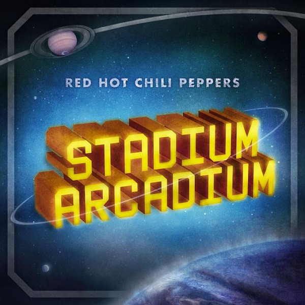

# Stadium Arcadium

By Red Hot Chili Peppers

## Album Data

[Discogs URL](https://www.discogs.com/release/853028-Red-Hot-Chili-Peppers-Stadium-Arcadium)

- Catalog #: 44391-1
- Label: Warner Bros. Records
- Format: Box, Sup + 4xLP, Album, 150
- Rating: 5
- Released: 2006
- Release ID: 853028
- Media condition: Mint (M)
- Sleeve condition: Mint (M)
- Speed: 33 rpm
- Weight: 150 gram

## See also

- [Freaky Styley](Freaky_Styley.md)
- [Mother's Milk](Mothers_Milk.md)
