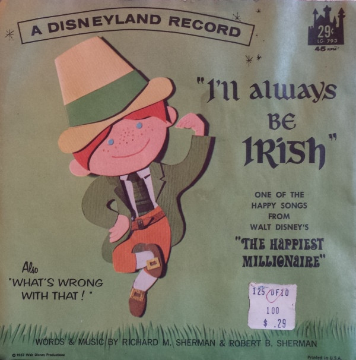

# I'll Always Be Irish

By Richard M. Sherman And Bill Lee

## Album Data

[Discogs URL](https://www.discogs.com/release/4968510-Richard-M.-Sherman-And-Bill-Lee-(4)-I'll-Always-Be-Irish)

- Catalog #: LG-793
- Label: Disneyland
- Formats: Vinyl
- Format: 7", 45 RPM
- Rating: 
- Released: 1967
- Year: null
- Release ID: 4968510
- Media condition: Good Plus (G+)
- Sleeve condition: 
- Speed: 45 rpm
- Weight: 

## Album Tracks

| **Position** | **Title** | **Duration** |
|--------------|-----------|--------------|
| A | **I'll Always Be Irish** |  |
| B | **What's Wrong With That** |  |

## Artist Roles

| **Name** | **Role** |
|----------|----------|
| **Richard M. Sherman** | Written-By, Music By |
| **Robert B. Sherman** | Written-By, Music By |

## See also

- 
