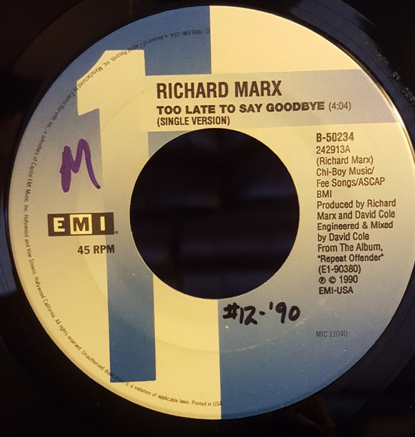

# Too Late To Say Goodbye

By Richard Marx

## Album Data

[Discogs URL](https://www.discogs.com/release/1424254-Richard-Marx-Too-Late-To-Say-Goodbye)

- Catalog #: B-50234
- Label: EMI USA
- Formats: Vinyl
- Format: 7", Single
- Rating: 
- Released: 1990
- Year: 1989
- Release ID: 1424254
- Media condition: Very Good Plus (VG+)
- Sleeve condition: 
- Speed: 45 rpm
- Weight: 

## Album Tracks

| **Position** | **Title** | **Duration** |
|--------------|-----------|--------------|
| A | **Too Late To Say Goodbye (Single Version)** | 4:04 |
| B | **Real World (LP Version)** | 4:13 |

## Artist Roles

| **Name** | **Role** |
|----------|----------|
| **David Cole (4)** | Engineer, Mixed By |
| **David Cole (4)** | Producer |
| **Richard Marx** | Producer |
| **Richard Marx** | Written-By |

## See also

- 
