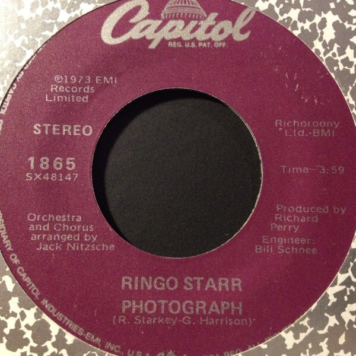

# Photograph

By Ringo Starr

## Album Data

[Discogs URL](https://www.discogs.com/release/3120354-Ringo-Starr-Photograph)

- Catalog #: 1865
- Label: Capitol Records
- Format: 7", Single, RE
- Rating: 
- Released: 1988
- Release ID: 3120354
- Media condition: Very Good Plus (VG+)
- Sleeve condition: Very Good Plus (VG+)
- Speed: 45 rpm
- Weight: 

## See also

- 
- [Beets: Ringo [Bonus Tracks]](../../Beets/Ringo_Starr/Ringo_[Bonus_Tracks].md)
- [Beets: Ringo](../../Beets/Ringo_Starr/Ringo.md)
- [Beets: Time Takes Time](../../Beets/Ringo_Starr/Time_Takes_Time.md)
- [Roon: Ringo](../../Roon/Ringo_Starr/Ringo.md)
- [Roon: Time Takes Time](../../Roon/Ringo_Starr/Time_Takes_Time.md)
