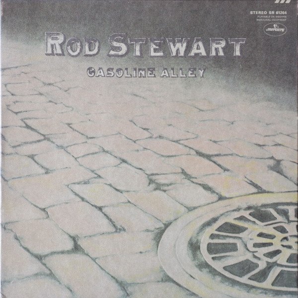

# Gasoline Alley

By Rod Stewart

## Album Data

[Discogs URL](https://www.discogs.com/release/1401820-Rod-Stewart-Gasoline-Alley)

- Catalog #: SR 61264, SR-61264
- Label: Mercury, Mercury
- Format: LP, Album, Phi
- Rating: 
- Released: 1970
- Release ID: 1401820
- Media condition: Very Good (VG)
- Sleeve condition: Good Plus (G+)
- Speed: 33 rpm
- Weight: 

## See also

- [Every Picture Tells A Story](Every_Picture_Tells_A_Story.md)
