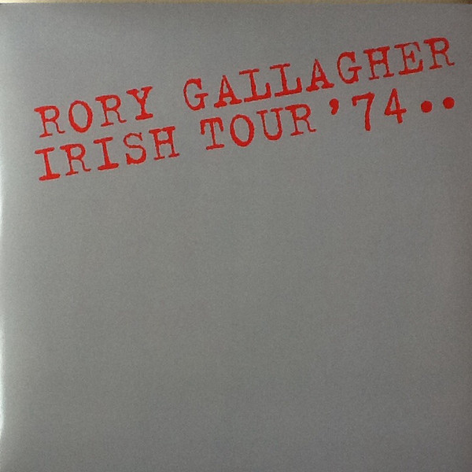

# Irish Tour '74..

By Rory Gallagher

## Album Data

[Discogs URL](https://www.discogs.com/release/6301754-Rory-Gallagher-Irish-Tour-'74..)

- Catalog #: MOVLP1262
- Label: Music On Vinyl, Sony Music, Capo (2), Legacy
- Format: 3xLP, Album, RE, RM, 180
- Rating: 
- Released: 2014
- Release ID: 6301754
- Media condition: Mint (M)
- Sleeve condition: Mint (M)
- Speed: 33 rpm
- Weight: 180 gram

## See also

- [Against The Grain](Against_The_Grain.md)
- [Calling Card](Calling_Card.md)
