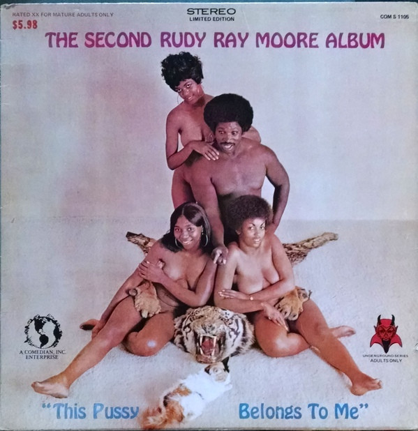

# The Second Rudy Ray Moore Album (This Pussy Belongs To Me)

By Rudy Ray Moore

## Album Data

[Discogs URL](https://www.discogs.com/release/7771158-Rudy-Ray-Moore-The-Second-Rudy-Ray-Moore-Album-(This-Pussy-Belongs-To-Me))

- Catalog #: COM S 1105
- Label: Comedians Inc.
- Formats: Vinyl
- Format: LP, Album, Ltd, Limited Edition
- Rating: 
- Released: 1970
- Year: 1970
- Release ID: 7771158
- Media condition: 
- Sleeve condition: Very Good (VG)
- Speed: 
- Weight: 

## Album Tracks

| **Position** | **Title** | **Duration** |
|--------------|-----------|--------------|
| A1 | **Signifying Monkey** |  |
| A2 | **40 Pounds Of Chittlings** |  |
| A3 | **Quart Of Buttermilk** |  |
| A4 | **Fall Out** |  |
| A5 | **The Gorillas Are Coming, And Others** |  |
| B1 | **Hurrican Annie Meets Dolemite** |  |
| B2 | **California Poetry** |  |
| B3 | **Mr Big Dick, And Others** |  |

## Artist Roles

| **Name** | **Role** |
|----------|----------|
| **Ralph Pierce** | Artwork [Cover] |
| **Rudy Ray Moore** | Edited By |
| **Jules Bihari** | Executive-Producer |
| **Fillmore Street Soul Rebellion** | Music By |
| **Take 5 Studio** | Photography By [Cover] |
| **Rudy Ray Moore** | Producer |
| **Theodore Toney** | Producer |
| **Warren Lanier** | Sleeve Notes |
| **Ben Taylor (3)** | Voice [Introduction] |

## See also

- 
