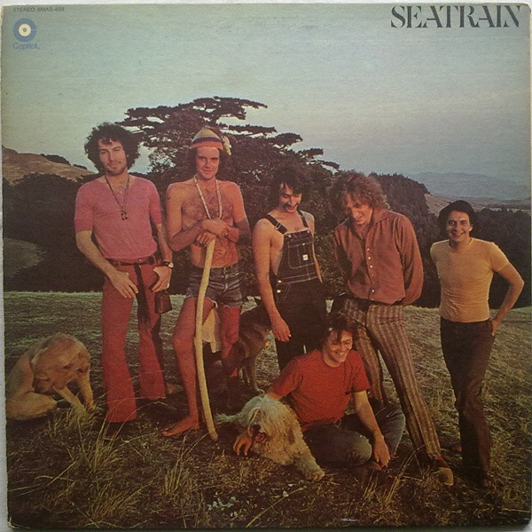

# Seatrain

By Seatrain

## Album Data

[Discogs URL](https://www.discogs.com/release/2882523-Seatrain-Seatrain)

- Catalog #: SMAS-659
- Label: Capitol Records
- Format: LP, Album, Gre
- Rating: 
- Released: 1971
- Release ID: 2882523
- Media condition: Very Good (VG)
- Sleeve condition: Very Good Plus (VG+)
- Speed: 33 rpm
- Weight: 

## Album Tracks

| **Position** | **Title** | **Duration** |
|--------------|-----------|--------------|
| A1 | **I'm Willin'** | 3:32 |
| A2 | **Song Of Job** | 6:04 |
| A3 | **Broken Morning** | 3:04 |
| A4 | **Home To You** | 3:22 |
| A5 | **Out Where The Hills** | 5:48 |
| B1 | **Waiting For Elijah** | 3:35 |
| B2 | **13 Questions** | 2:58 |
| B3 | **Oh My Love** | 2:50 |
| B4 | **Sally Goodin'** | 2:09 |
| B5 | **Creepin' Midnight** | 5:20 |
| B6 | **Orange Blossom Special** | 5:07 |

## Artist Roles

| **Name** | **Role** |
|----------|----------|
| **Andy Kulberg** | Bass, Vocals, Flute |
| **Ira Friedlander** | Design |
| **Bob Cato** | Design, Photography |
| **Larry Atamanuik** | Drums, Percussion |
| **Bill Price** | Engineer |
| **Peter Rowan** | Lead Vocals, Guitar |
| **Lloyd Baskin** | Lead Vocals, Keyboards |
| **Jim Roberts (4)** | Lyrics By |
| **Al Vandenberg** | Photography |
| **George Martin** | Producer |
| **Richard Greene** | Violin, Viola, Keyboards, Vocals |

## See also

- 
- [Beets: Seatrain](../../Beets/Seatrain/Seatrain.md)
