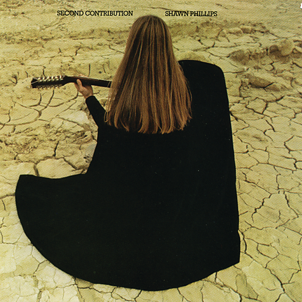

# Second Contribution

By Shawn Phillips

## Album Data

[Discogs URL](https://www.discogs.com/release/1462084-Shawn-Phillips-(2)-Second-Contribution)

- Catalog #: SP-4282
- Label: A&M Records
- Format: LP, Album, Pit
- Rating: 
- Released: 1970
- Release ID: 1462084
- Media condition: Very Good (VG)
- Sleeve condition: Very Good Plus (VG+)
- Speed: 33 rpm
- Weight: 

## Album Tracks

| **Position** | **Title** | **Duration** |
|--------------|-----------|--------------|
| A1 | **She Was Waitin' For Her Mother At The Station In Torino And You Know I Love You Baby But It's Getting Too Heavy To Laugh (Swwfhmatsitaykilybbigth)** | 4:54 |
| A2 | **Keep On** | 3:21 |
| A3 | **Sleepwalker** | 1:32 |
| A4 | **Song For Mr. C** | 3:49 |
| A5 | **The Ballad Of Casey Deiss** | 6:12 |
| B1 | **Song For Sagittarians** | 3:43 |
| B2 | **Lookin' Up Lookin' Down** | 3:55 |
| B3 | **Remedial Interruption** | 1:56 |
| B4 | **Whaz' Zat** | 1:56 |
| B5 | **Schmaltz Waltz** | 1:44 |
| B6 | **F Sharp Splendor** | 0:36 |
| B7 | **Steel Eyes** | 4:18 |

## See also

- 
- [Beets: Second Contribution](../../Beets/Shawn_Phillips/Second_Contribution.md)
- [CD: Second Contribution](../../CD/Shawn_Phillips/Second_Contribution.md)
- [CD: ](../../CD/Shawn_Phillips/Shawn_Phillips.md)
