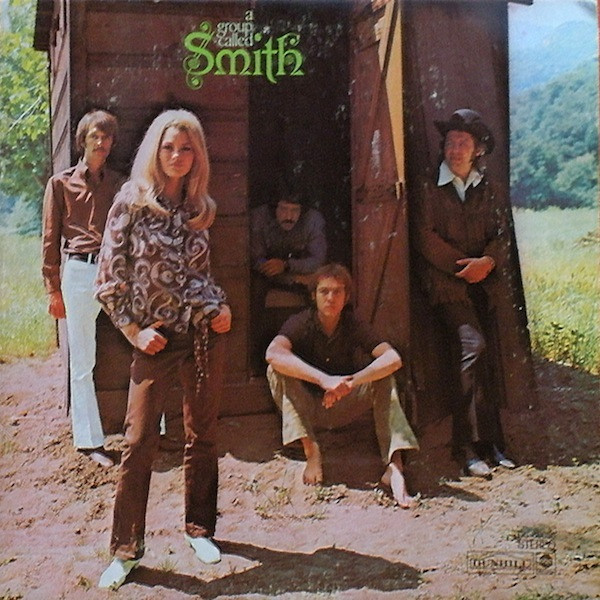

# A Group Called Smith

By Smith

## Album Data

[Discogs URL](https://www.discogs.com/release/1224369-Smith-(3)-A-Group-Called-Smith)

- Catalog #: DS-50056
- Label: Dunhill, ABC Records
- Format: LP, Album, RE
- Rating: 
- Released: 1971
- Release ID: 1224369
- Media condition: Very Good Plus (VG+)
- Sleeve condition: Very Good Plus (VG+)
- Speed: 33 rpm
- Weight: 

## See also

- [Take A Look Around](Take_A_Look_Around.md)
