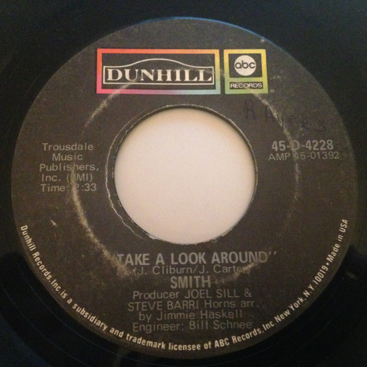

# Take A Look Around

By Smith

## Album Data

[Discogs URL](https://www.discogs.com/release/6755763-Smith-(3)-Take-A-Look-Around)

- Catalog #: 45-D-4228
- Label: ABC/Dunhill Records
- Format: 7", Single
- Rating: 
- Released: 1970
- Release ID: 6755763
- Media condition: Very Good Plus (VG+)
- Sleeve condition: 
- Speed: 45 rpm
- Weight: 

## See also

- [A Group Called Smith](A_Group_Called_Smith.md)
