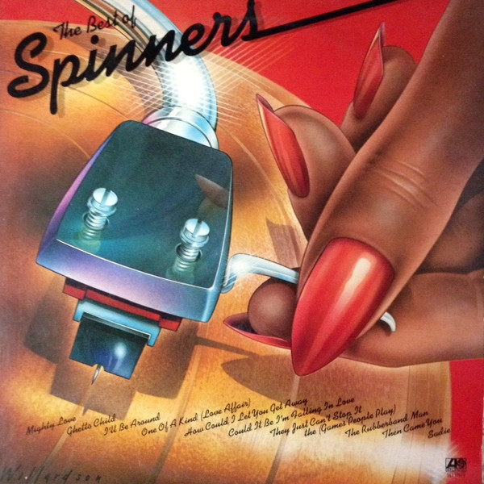

# The Best Of Spinners

By Spinners

## Album Data

[Discogs URL](https://www.discogs.com/release/5904126-Spinners-The-Best-Of-Spinners)

- Catalog #: SD 19179
- Label: Atlantic
- Formats: Vinyl, PR
- Format: LP, Comp, PR
- Rating: 
- Released: 1978
- Year: 1978
- Release ID: 5904126
- Media condition: Very Good Plus (VG+)
- Sleeve condition: Very Good Plus (VG+)
- Speed: 33 rpm
- Weight: 

## Album Tracks

| **Position** | **Title** | **Duration** |
|--------------|-----------|--------------|
| A1 | **I'll Be Around** | 3:10 |
| A2 | **How Could I Let You Get Away** | 3:45 |
| A3 | **One Of A Kind (Love Affair)** | 3:19 |
| A4 | **Mighty Love** | 4:56 |
| A5 | **Ghetto Child** | 3:47 |
| B1 | **Then Came You** | 3:57 |
| B2 | **Sadie** | 3:30 |
| B3 | **Could It Be I'm Falling In Love** | 4:12 |
| B4 | **They Just Can't Stop It The (Games People Play)** | 3:28 |
| B5 | **The Rubberband Man** | 3:32 |

## Artist Roles

| **Name** | **Role** |
|----------|----------|
| **Thom Bell** | Producer, Arranged By |

## See also

- 
