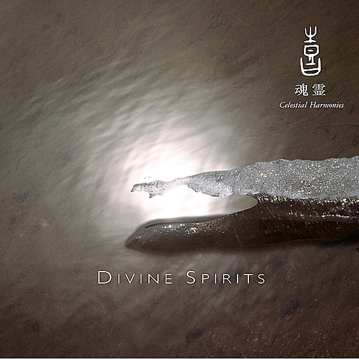

# Spirit

By Spirit

## Album Data

[Discogs URL](https://www.discogs.com/release/2958004-Spirit-(8)-Spirit)

- Catalog #: LP 5194
- Label: Sundazed Music
- Formats: Vinyl
- Format: LP, Album, Mono, RE
- Rating: 
- Released: 2005
- Year: 1968
- Release ID: 2958004
- Media condition: Mint (M)
- Sleeve condition: Mint (M)
- Speed: 33 rpm
- Weight: 180 gram

## Album Tracks

| **Position** | **Title** | **Duration** |
|--------------|-----------|--------------|
| A1 | **Fresh-Garbage** | 3:10 |
| A2 | **Uncle Jack** | 2:46 |
| A3 | **Mechanical World** | 5:15 |
| A4 | **Taurus** | 2:35 |
| A5 | **Girl In Your Eye** | 3:15 |
| A6 | **Straight Arrow** | 2:46 |
| B1 | **Topanga Windows** | 3:36 |
| B2 | **Gramophone Man** | 2:46 |
| B3 | **Water Woman** | 2:05 |
| B4 | **The Great Canyon Fire In General** | 2:50 |
| B5 | **Elijah** | 10:45 |

## Artist Roles

| **Name** | **Role** |
|----------|----------|
| **Marty Paich** | Arranged By [Strings, Horns] |
| **Tom Wilkes (2)** | Art Direction |
| **Mark Andes** | Bass, Vocals |
| **Corporate Head** | Design [Album Design] |
| **Ed Cassidy** | Drums, Percussion |
| **Armin Steiner** | Engineer |
| **Eirik W. Wangberg** | Engineer |
| **Michael Lietz** | Engineer |
| **Randy California** | Guitar |
| **John Locke** | Keyboards |
| **Jay Thompson (4)** | Photography By [Back Cover] |
| **Guy Webster** | Photography By [Cover] |
| **Lou Adler** | Producer |
| **Jay Ferguson** | Vocals, Percussion |

## See also

- [Clear](Clear.md)
- [Twelve Dreams Of Dr. Sardonicus](Twelve_Dreams_Of_Dr_Sardonicus.md)
- [Beets: Clear](../../Beets/Spirit/Clear.md)
- [Beets: Feedback](../../Beets/Spirit/Feedback.md)
- [Beets: Spirit](../../Beets/Spirit/Spirit.md)
- [Beets: The Best Of Spirit](../../Beets/Spirit/The_Best_Of_Spirit.md)
- [Beets: The Family That Plays Together](../../Beets/Spirit/The_Family_That_Plays_Together.md)
- [Beets: Twelve Dreams of Dr. Sardonicus](../../Beets/Spirit/Twelve_Dreams_of_Dr_Sardonicus.md)
- [Roon: Clear](../../Roon/Spirit/Clear.md)
- [Roon: Feedback](../../Roon/Spirit/Feedback.md)
- [Roon: Spirit](../../Roon/Spirit/Spirit.md)
- [Roon: The Best Of Spirit](../../Roon/Spirit/The_Best_Of_Spirit.md)
- [Roon: The Family That Plays Together](../../Roon/Spirit/The_Family_That_Plays_Together.md)
- [Roon: Twelve Dreams Of Dr. Sardonicus](../../Roon/Spirit/Twelve_Dreams_Of_Dr_Sardonicus.md)
